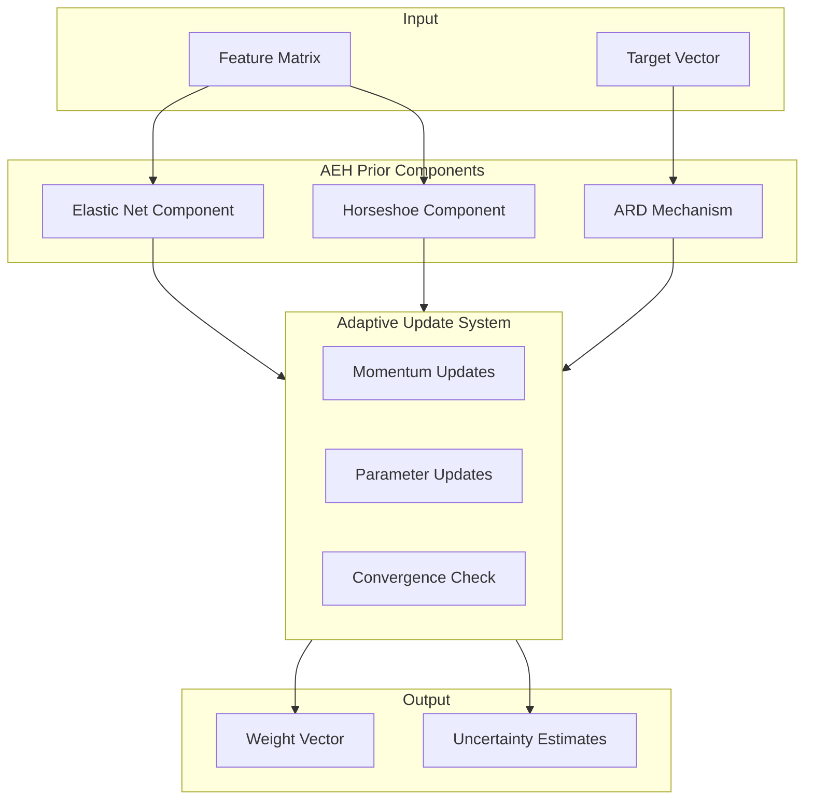
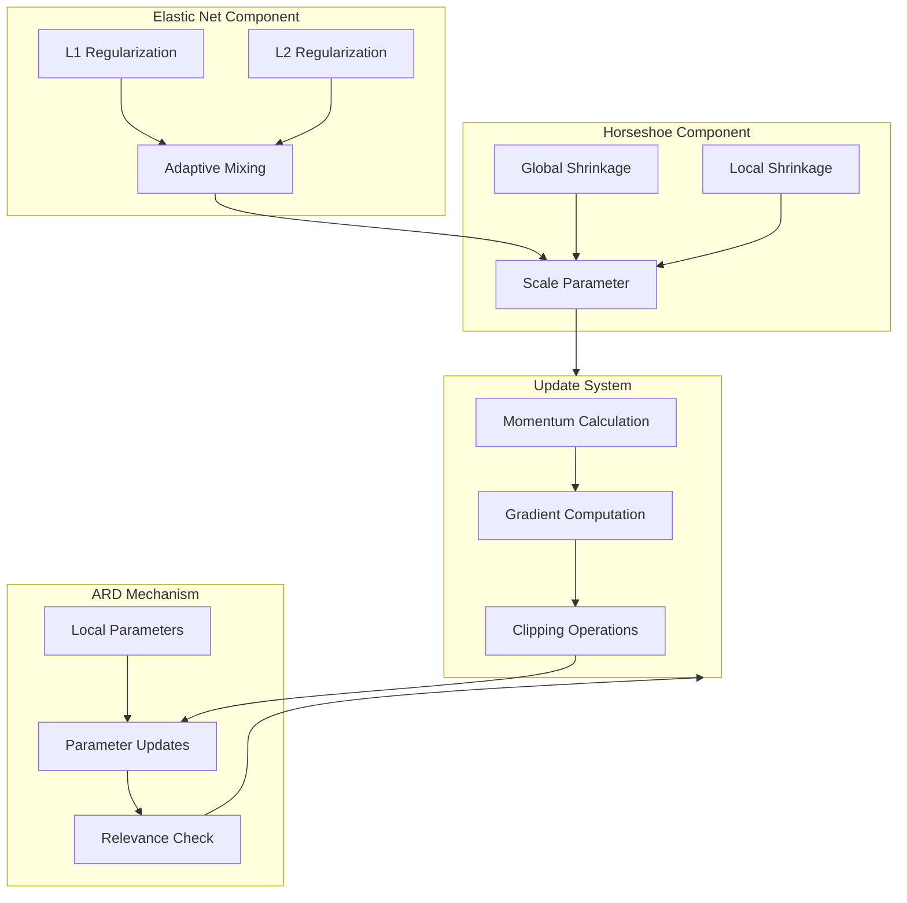
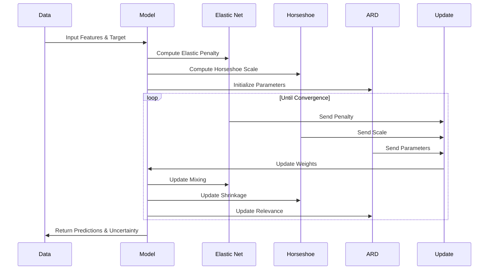

# Adaptive Elastic Horseshoe (AEH) Prior Architecture

## High-Level Architecture



## Detailed Component Architecture



## Parameter Flow Diagram

```mermaid
flowchart LR
    subgraph Parameters[Key Parameters]
        alpha[α: Mixing Parameter]
        beta[β: Regularization Strength]
        tau[τ: Global Shrinkage]
        lambda[λ: Local Shrinkage]
    end

    subgraph Updates[Update Rules]
        alpha_update[α_{t+1} = clip(α_t + γ * (0.5 - importance_ratio), 0.1, 0.9)]
        beta_update[β_{t+1} = clip(β_t + γ * (1.0 - uncertainty_ratio), 0.1, 10.0)]
        lambda_update[λ_{t+1} = λ_t + momentum_{t+1}]
    end

    subgraph Momentum[Momentum System]
        momentum[momentum_{t+1} = ρ * momentum_t + γ * grad_w log p(w_t)]
    end

    Parameters --> Updates
    Updates --> Momentum
    Momentum --> Parameters
```

## Implementation Flow



## Notes on Architecture

1. **Elastic Net Component**
   - Combines L1 and L2 regularization
   - Adaptive mixing parameter (α) balances sparsity and density
   - Handles feature selection and regularization

2. **Horseshoe Component**
   - Provides heavy-tailed shrinkage
   - Global (τ) and local (λ) shrinkage parameters
   - Enables adaptive feature selection

3. **ARD Mechanism**
   - Automatic Relevance Determination
   - Feature-specific shrinkage parameters
   - Dynamic feature importance assessment

4. **Update System**
   - Momentum-based updates for stability
   - Gradient computation for optimization
   - Clipping operations for numerical stability

5. **Convergence Criteria**
   - Bounded parameter updates
   - Momentum-based convergence
   - Multiple convergence thresholds 