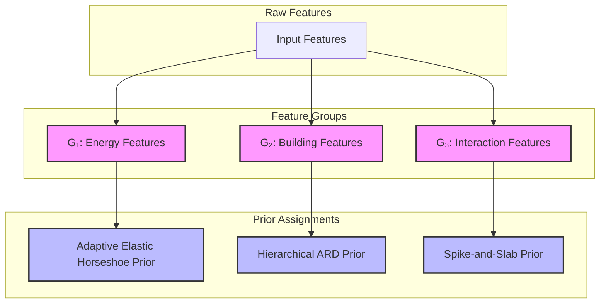
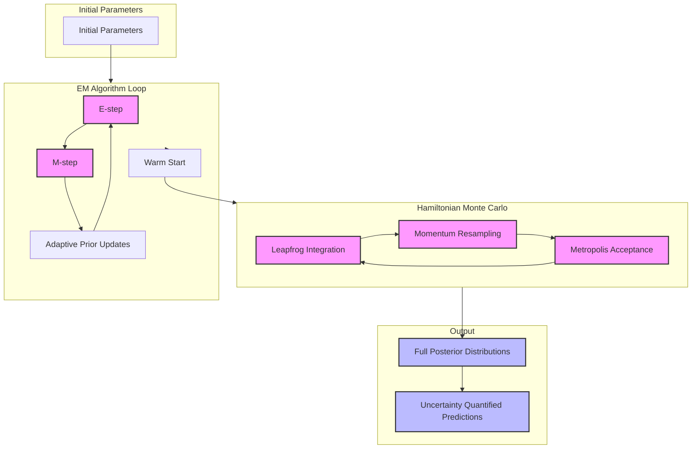

# Adaptive Elastic Horseshoe (AEH) Prior: Key Diagrams

## 1. Group-wise Prior Allocation Diagram

This diagram illustrates how different feature groups are assigned specific priors based on their characteristics and modeling requirements.

### Rationale for Prior Assignments

1. **Energy Features (G₁)**: Adaptive Elastic Horseshoe Prior
   - Handles heavy-tailed distributions
   - Provides adaptive shrinkage
   - Ideal for energy consumption patterns with extreme values
   - Maintains sparsity while allowing for strong signals

2. **Building Features (G₂)**: Hierarchical ARD Prior
   - Captures hierarchical structure of building characteristics
   - Maintains interpretability
   - Provides automatic relevance determination
   - Balances model complexity with performance

3. **Interaction Features (G₃)**: Spike-and-Slab Prior
   - Effectively models sparse interactions
   - Helps identify truly significant feature interactions
   - Provides clear feature selection mechanism
   - Reduces overfitting in interaction terms

## 2. EM and HMC Integration Flowchart

This diagram represents the dual-stage inference approach combining Expectation-Maximization (EM) and Hamiltonian Monte Carlo (HMC) for robust parameter estimation and uncertainty quantification.

### Inference Process Description

1. **EM Algorithm Stage**:
   - **E-step**: Computes expected values of latent variables
   - **M-step**: Updates model parameters
   - **Adaptive Prior Updates**: Refines prior parameters based on data evidence
   - **Warm Start**: Provides initial estimates for HMC

2. **Hamiltonian Monte Carlo Stage**:
   - **Leapfrog Integration**: Simulates Hamiltonian dynamics for efficient exploration
   - **Momentum Resampling**: Ensures proper exploration of the parameter space
   - **Metropolis Acceptance**: Maintains detailed balance for correct sampling
   - **Posterior Exploration**: Generates full posterior distributions

3. **Output Generation**:
   - **Full Posterior Distributions**: Complete uncertainty quantification for all parameters
   - **Uncertainty Quantified Predictions**: Predictions with associated confidence intervals
   - **Model Diagnostics**: Convergence metrics and sampling statistics 