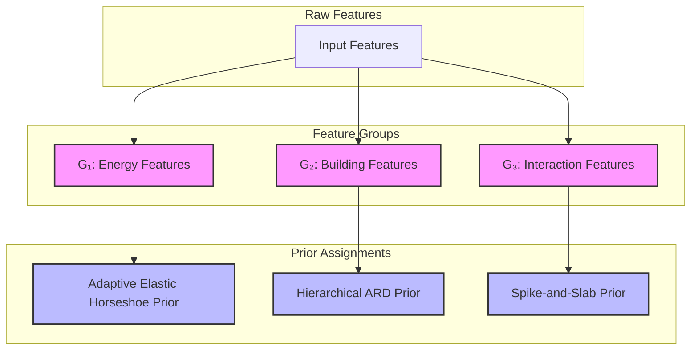
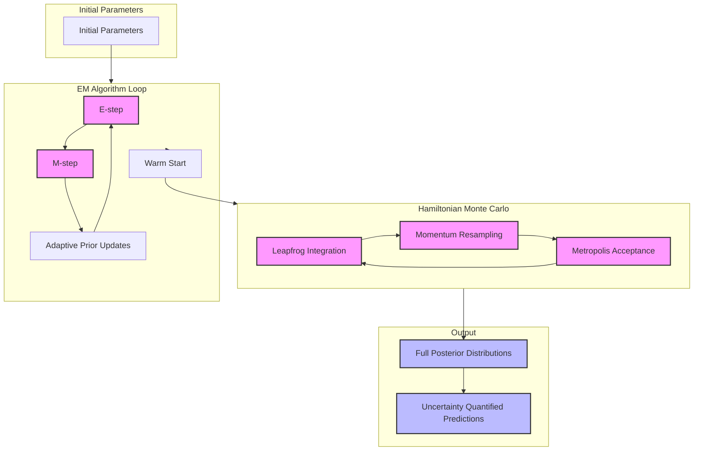

# Adaptive Elastic Horseshoe Prior: Implementation Guide

## Setup and Installation

### Environment Setup
1. **Python Requirements**:
   ```python
   python >= 3.8
   numpy >= 1.20.0
   scipy >= 1.7.0
   pandas >= 1.3.0
   scikit-learn >= 0.24.0
   matplotlib >= 3.4.0
   seaborn >= 0.11.0
   ```

2. **Installation**:
   ```bash
   pip install -r requirements.txt
   ```

3. **Configuration Setup**:
   ```python
   from arehap import AdaptivePriorConfig, AdaptivePriorARD
   
   config = AdaptivePriorConfig(
       alpha_0=1e-6,
       beta_0=1e-6,
       max_iter=200,
       tol=1e-4,
       n_splits=3,
       random_state=42,
       prior_type='hierarchical',
       adaptation_rate=0.1,
       uncertainty_threshold=0.1,
       group_sparsity=True,
       dynamic_shrinkage=True,
       use_hmc=True,
       hmc_steps=10,
       hmc_epsilon=0.01,
       hmc_leapfrog_steps=10,
       uncertainty_calibration=True,
       calibration_factor=10.0,
       robust_noise=True,
       student_t_df=3.0
   )
   ```

4. **Data Preparation**:
   ```python
   import pandas as pd
   import numpy as np
   from sklearn.preprocessing import RobustScaler, StandardScaler
   
   # Load and preprocess data
   X = pd.read_csv('features.csv')
   y = pd.read_csv('target.csv')
   
   # Scale features and target
   scaler_X = RobustScaler()
   scaler_y = StandardScaler()
   
   X_scaled = scaler_X.fit_transform(X)
   y_scaled = scaler_y.fit_transform(y)
   ```

## Basic Usage

### Model Initialization
```python
# Initialize model
model = AdaptivePriorARD(config=config)

# Define feature groups
feature_groups = {
    'energy': ['energy_consumption', 'energy_intensity'],
    'building': ['floor_area', 'building_age'],
    'interaction': ['energy_area_interaction', 'age_energy_interaction']
}
```

### Training Process
```python
# Fit model
model.fit(X_scaled, y_scaled)

# Get predictions
y_pred, y_std = model.predict(X_scaled, return_std=True)

# Get feature importance
importance = model.get_feature_importance()
```

### Uncertainty Estimation
```python
# Get prediction intervals
confidence_levels = [0.5, 0.8, 0.9, 0.95, 0.99]
intervals = {}

for level in confidence_levels:
    z_score = stats.norm.ppf(1 - (1 - level) / 2)
    lower = y_pred - z_score * y_std
    upper = y_pred + z_score * y_std
    intervals[level] = (lower, upper)
```

## Advanced Usage

### Custom Prior Configuration
```python
# Custom prior types for different groups
group_prior_types = {
    'energy': 'adaptive_elastic_horseshoe',
    'building': 'hierarchical',
    'interaction': 'spike_slab'
}

config.group_prior_types = group_prior_types
```

### Feature Group Definition
```python
# Define custom feature groups
custom_groups = {
    'energy': {
        'features': ['energy_consumption', 'energy_intensity'],
        'prior_type': 'adaptive_elastic_horseshoe',
        'hyperparams': {
            'lambda': 1.0,
            'tau': 1.0,
            'alpha': 0.5,
            'beta': 1.0
        }
    },
    'building': {
        'features': ['floor_area', 'building_age'],
        'prior_type': 'hierarchical',
        'hyperparams': {
            'lambda': 1.0,
            'tau': 1.0,
            'nu': 2.0
        }
    }
}
```

### Cross-Validation Setup
```python
# Custom cross-validation
from sklearn.model_selection import KFold

cv = KFold(n_splits=5, shuffle=True, random_state=42)
cv_scores = []

for train_idx, val_idx in cv.split(X_scaled):
    X_train, X_val = X_scaled[train_idx], X_scaled[val_idx]
    y_train, y_val = y_scaled[train_idx], y_scaled[val_idx]
    
    model.fit(X_train, y_train)
    y_pred, y_std = model.predict(X_val, return_std=True)
    
    # Calculate metrics
    r2 = r2_score(y_val, y_pred)
    rmse = np.sqrt(mean_squared_error(y_val, y_pred))
    cv_scores.append({'r2': r2, 'rmse': rmse})
```

### MCMC Diagnostics
```python
# Get MCMC diagnostics
r_hat_stats = model._calculate_gelman_rubin(chains)
ess_stats = model._calculate_effective_sample_size(chains)

# Plot diagnostics
import matplotlib.pyplot as plt

plt.figure(figsize=(10, 6))
plt.plot(r_hat_stats.values())
plt.axhline(y=1.1, color='r', linestyle='--')
plt.title('Gelman-Rubin R² Statistics')
plt.show()
```

## Feature Grouping and Group-wise Prior Specification

### Group-wise Prior Allocation


**Rationale for Prior Assignments:**
- **Energy Features (G₁)**: Adaptive Elastic Horseshoe prior is used for its ability to handle heavy-tailed distributions and provide adaptive shrinkage, ideal for energy consumption patterns that often show extreme values.
- **Building Features (G₂)**: Hierarchical ARD prior is employed to capture the hierarchical structure of building characteristics while maintaining interpretability.
- **Interaction Features (G₃)**: Spike-and-Slab prior is chosen for its ability to effectively model sparse interactions between features, helping identify truly significant feature interactions.

## Model Training and Inference

### Inference Strategy

#### EM and HMC Integration Flow


**Inference Process Description:**
1. **EM Algorithm**:
   - E-step: Computes expected values of latent variables
   - M-step: Updates model parameters
   - Adaptive Prior Updates: Refines prior parameters based on data evidence
   - Provides warm start for HMC

2. **Hamiltonian Monte Carlo**:
   - Leapfrog Integration: Simulates Hamiltonian dynamics
   - Momentum Resampling: Ensures proper exploration
   - Metropolis Acceptance: Maintains detailed balance
   - Produces full posterior distributions

3. **Output**:
   - Full posterior distributions for all parameters
   - Uncertainty-quantified predictions with confidence intervals

## API Reference

### Class: AdaptivePriorARD

#### Methods

1. **__init__(config=None)**
   - Initializes the model with configuration
   - Parameters:
     - config: AdaptivePriorConfig object
   - Returns: None

2. **fit(X, y)**
   - Fits the model to data
   - Parameters:
     - X: Feature matrix
     - y: Target vector
   - Returns: self

3. **predict(X, return_std=False)**
   - Makes predictions
   - Parameters:
     - X: Feature matrix
     - return_std: Whether to return uncertainty
   - Returns: predictions, uncertainty (optional)

4. **get_feature_importance()**
   - Gets feature importance scores
   - Returns: importance array

5. **save_model(path)**
   - Saves model to file
   - Parameters:
     - path: Save path
   - Returns: None

6. **load_model(path)**
   - Loads model from file
   - Parameters:
     - path: Load path
   - Returns: model

#### Attributes

1. **alpha**: Noise precision
2. **beta**: Weight precisions
3. **m**: Mean of weights
4. **S**: Covariance of weights
5. **prior_hyperparams**: Prior hyperparameters
6. **feature_groups**: Feature grouping
7. **shrinkage_params**: Shrinkage parameters

## Performance Tuning

### Hyperparameter Optimization
```python
from sklearn.model_selection import GridSearchCV

param_grid = {
    'alpha_0': [1e-7, 1e-6, 1e-5],
    'beta_0': [1e-7, 1e-6, 1e-5],
    'adaptation_rate': [0.01, 0.1, 0.2],
    'uncertainty_threshold': [0.1, 0.2, 0.3]
}

grid_search = GridSearchCV(
    AdaptivePriorARD(),
    param_grid,
    cv=3,
    scoring='neg_mean_squared_error'
)
```

### Memory Management
```python
# Batch processing
batch_size = 1000
n_batches = len(X) // batch_size

for i in range(n_batches):
    start_idx = i * batch_size
    end_idx = (i + 1) * batch_size
    
    X_batch = X[start_idx:end_idx]
    y_batch = y[start_idx:end_idx]
    
    model.fit(X_batch, y_batch)
```

### Computational Efficiency
```python
# Parallel processing
from joblib import Parallel, delayed

def process_batch(batch_idx):
    start_idx = batch_idx * batch_size
    end_idx = (batch_idx + 1) * batch_size
    
    X_batch = X[start_idx:end_idx]
    y_batch = y[start_idx:end_idx]
    
    return model.fit(X_batch, y_batch)

results = Parallel(n_jobs=-1)(
    delayed(process_batch)(i) for i in range(n_batches)
)
```

### Early Stopping
```python
# Custom early stopping
patience = 10
best_loss = float('inf')
no_improve = 0

for epoch in range(max_epochs):
    model.fit(X_train, y_train)
    val_loss = model.evaluate(X_val, y_val)
    
    if val_loss < best_loss:
        best_loss = val_loss
        no_improve = 0
    else:
        no_improve += 1
        
    if no_improve >= patience:
        break
``` 