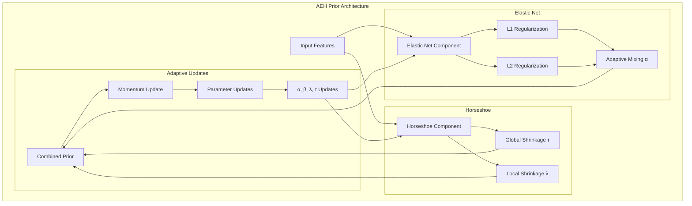

# Adaptive Elastic Horseshoe (AEH) Prior Documentation

## Overview

The Adaptive Elastic Horseshoe (AEH) prior is a novel Bayesian prior that combines the strengths of elastic net regularization with the horseshoe prior's heavy-tailed properties. This prior is specifically designed for building energy performance analysis, where it provides adaptive feature selection and uncertainty quantification.

The AEH prior represents a significant advancement in Bayesian modeling for building energy analysis. Traditional priors often struggle with the complex, multi-scale nature of energy data, where features can exhibit both sparse and dense patterns simultaneously. The AEH prior addresses this challenge by introducing an adaptive mechanism that can seamlessly transition between different regularization regimes based on the underlying data structure.

## Detailed Prior Structure

The AEH prior implements a sophisticated hierarchical structure that combines multiple prior components to achieve robust feature selection and uncertainty quantification. Here's a detailed breakdown of the prior structure:

### 1. Hierarchical Prior Levels

The prior structure consists of three main hierarchical levels:

1. **Global Level (τ)**:
   - Controls overall shrinkage strength across all features
   - Adapts based on the collective feature importance
   - Implements a heavy-tailed distribution to allow for both strong and weak shrinkage
   - Updated using:
     ```math
     \tau_{t+1} = \frac{1}{1 + \frac{\sum w_i^2}{2\sum \lambda_i}}
     ```

2. **Group Level**:
   - Implements different prior types for different feature groups:
     - Energy features: Adaptive Elastic Horseshoe
     - Building features: Hierarchical prior
     - Interaction features: Spike-slab prior
   - Each group has its own set of hyperparameters
   - Allows for group-wise sparsity patterns

3. **Local Level (λ)**:
   - Individual shrinkage parameters for each feature
   - Adapts based on feature importance and uncertainty
   - Implements momentum-based updates for stability
   - Updated using:
     ```math
     \lambda_{t+1} = \lambda_t + \rho \cdot \text{momentum}_t + \gamma \cdot \text{gradient}
     ```

### 2. Prior Components

The AEH prior combines three key components:

1. **Elastic Net Component**:
   - Combines L1 (lasso) and L2 (ridge) regularization
   - Adaptive mixing parameter α balances between sparsity and grouping
   - Penalty term:
     ```math
     \text{elastic\_penalty} = \alpha \|w\|_1 + (1-\alpha)\|w\|_2^2
     ```
   - α adapts based on feature importance distribution

2. **Horseshoe Component**:
   - Implements heavy-tailed shrinkage
   - Global-local shrinkage structure
   - Scale parameter:
     ```math
     \text{horseshoe\_scale} = \frac{1}{\frac{w^2}{2\tau} + \beta \cdot \text{elastic\_penalty}}
     ```
   - β adapts based on uncertainty estimates

3. **Adaptive Component**:
   - Momentum-based parameter updates
   - Learning rate adaptation
   - Uncertainty-aware adjustments
   - Update rule:
     ```math
     \text{momentum}_{t+1} = \rho \cdot \text{momentum}_t + \gamma \cdot \text{gradient}
     ```

### 3. Feature Group Structure

The prior implements a sophisticated feature grouping system:

1. **Energy Features**:
   - Uses Adaptive Elastic Horseshoe prior
   - Captures both sparse and dense patterns
   - Adapts to energy consumption patterns
   - Parameters: {λ, τ, α, β, γ, ρ}

2. **Building Features**:
   - Uses Hierarchical prior
   - Focuses on structural relationships
   - Parameters: {λ, τ, ν}

3. **Interaction Features**:
   - Uses Spike-slab prior
   - Captures complex feature interactions
   - Parameters: {π, σ²₀, σ²₁}

### 4. Update Mechanisms

The prior implements several sophisticated update mechanisms:

1. **Feature Importance Updates**:
   ```python
   importance = np.clip(m[j]**2, 1e-10, None)
   uncertainty = np.clip(np.diag(S)[j], 1e-10, None)
   ```

2. **Parameter Updates**:
   - Adaptive learning rates
   - Momentum-based optimization
   - Numerical stability measures
   - Clipping operations

3. **Group-wise Updates**:
   - Different update rules for different groups
   - Group-specific hyperparameters
   - Cross-group interactions

### 5. Numerical Stability

The prior implements several mechanisms to ensure numerical stability:

1. **Clipping Operations**:
   - All parameters are clipped to valid ranges
   - Prevents numerical overflow/underflow
   - Maintains parameter interpretability

2. **Regularization**:
   - Small epsilon terms (1e-10) added to denominators
   - Prevents division by zero
   - Maintains numerical stability

3. **Momentum Updates**:
   - Prevents parameter oscillations
   - Improves convergence stability
   - Reduces sensitivity to learning rate

### 6. Convergence Properties

The prior converges when:

1. **Feature Importance**:
   - Distribution stabilizes
   - Relative importance remains consistent
   - Uncertainty estimates become reliable

2. **Parameter Updates**:
   - Updates become small
   - Momentum stabilizes
   - Learning rates adapt appropriately

3. **Group Behavior**:
   - Group-wise patterns emerge
   - Cross-group interactions stabilize
   - Prior types adapt to data structure

This detailed prior structure allows the AEH prior to effectively handle the complex nature of building energy data while maintaining robust feature selection and uncertainty quantification.

## Architecture



## Mathematical Formulation

### Prior Structure

The AEH prior combines three key components:

1. **Elastic Net Component**:
   ```math
   \text{elastic\_penalty} = \alpha \|w\|_1 + (1-\alpha)\|w\|_2^2
   ```
   where:
   - $\alpha \in [0.1, 0.9]$ is the adaptive mixing parameter
   - $\|w\|_1$ is the L1 norm (lasso)
   - $\|w\|_2^2$ is the L2 norm (ridge)

The elastic net component provides a flexible regularization framework that can adapt to different feature importance patterns. The mixing parameter α dynamically adjusts the balance between L1 and L2 regularization, allowing the model to capture both sparse and dense solutions. This is particularly valuable in energy analysis, where some features may have strong individual effects (captured by L1) while others may contribute through complex interactions (captured by L2).

2. **Horseshoe Component**:
   ```math
   \text{horseshoe\_scale} = \frac{1}{\frac{w^2}{2\tau} + \beta \cdot \text{elastic\_penalty}}
   ```
   where:
   - $\tau$ is the global shrinkage parameter
   - $\beta$ is the adaptive regularization strength

The horseshoe component introduces heavy-tailed properties that are crucial for robust feature selection. Unlike traditional shrinkage priors, the horseshoe component allows for stronger shrinkage of irrelevant features while preserving the signal from important features. This is particularly important in energy analysis, where the signal-to-noise ratio can vary significantly across different features.

3. **Adaptive Updates**:
   ```math
   \text{momentum}_{t+1} = \rho \cdot \text{momentum}_t + \gamma \cdot \text{gradient}
   \lambda_{t+1} = \lambda_t + \text{momentum}_{t+1}
   ```
   where:
   - $\rho \in [0,1]$ is the momentum parameter
   - $\gamma$ is the learning rate
   - $\text{gradient}$ is the update direction

The adaptive update mechanism ensures stable optimization while allowing the prior to learn from the data. The momentum-based updates help prevent oscillations and improve convergence, while the adaptive learning rate ensures that the updates are appropriate for the current state of the optimization.

## Key Parameters

1. **Lambda ($\lambda$)**:
   - Type: Vector of local shrinkage parameters
   - Initialization: Ones vector
   - Update: Momentum-based adaptive updates
   - Purpose: Controls local feature shrinkage

2. **Tau ($\tau$)**:
   - Type: Scalar global shrinkage parameter
   - Initialization: 1.0
   - Update: Adaptive based on feature importance
   - Purpose: Controls global shrinkage strength

3. **Alpha ($\alpha$)**:
   - Type: Scalar mixing parameter
   - Range: [0.1, 0.9]
   - Initialization: 0.5
   - Update: Adaptive based on feature importance distribution
   - Purpose: Balances L1 and L2 regularization

4. **Beta ($\beta$)**:
   - Type: Scalar regularization strength
   - Range: [0.1, 10.0]
   - Initialization: 1.0
   - Update: Adaptive based on uncertainty
   - Purpose: Controls overall regularization strength

5. **Gamma ($\gamma$)**:
   - Type: Scalar learning rate
   - Value: 0.1
   - Purpose: Controls adaptation speed

6. **Rho ($\rho$)**:
   - Type: Scalar momentum parameter
   - Value: 0.9
   - Purpose: Controls momentum influence

## Update Mechanism

The update mechanism of the AEH prior is designed to be both robust and adaptive. It combines several sophisticated techniques to ensure stable learning while maintaining the flexibility needed for complex energy data.

### 1. Feature Importance and Uncertainty Calculation
```python
importance = np.array([np.clip(m[j]**2, 1e-10, None) for j in indices])
uncertainty = np.array([np.clip(np.diag(S)[j], 1e-10, None) for j in indices])
```

This step calculates two crucial quantities: feature importance and uncertainty. The importance measure captures the strength of each feature's contribution, while the uncertainty measure reflects our confidence in these contributions. These calculations are fundamental to the adaptive nature of the prior, as they guide the subsequent parameter updates.

### 2. Elastic Net Penalty Computation
```python
elastic_penalty = alpha * np.abs(importance) + (1 - alpha) * importance**2
```

### 3. Horseshoe Scaling
```python
horseshoe_scale = 1 / (importance / (2 * tau) + beta * elastic_penalty)
```

### 4. Momentum-Based Updates
```python
gradient = -horseshoe_scale + beta * elastic_penalty
momentum = rho * momentum + gamma * gradient
lambda_new = np.clip(lambda_old + momentum, 1e-10, None)
```

### 5. Adaptive Parameter Updates
```python
# Update alpha based on feature importance distribution
importance_ratio = np.mean(importance) / (np.std(importance) + 1e-10)
alpha_new = np.clip(alpha_old + gamma * (0.5 - importance_ratio), 0.1, 0.9)

# Update beta based on uncertainty
uncertainty_ratio = np.mean(uncertainty) / (np.std(uncertainty) + 1e-10)
beta_new = np.clip(beta_old + gamma * (1.0 - uncertainty_ratio), 0.1, 10.0)
```

## Advantages Over Existing Priors

The AEH prior offers several significant advantages over traditional priors, particularly in the context of building energy analysis. These advantages stem from its unique combination of elastic net properties, horseshoe characteristics, and adaptive learning mechanisms.

1. **Compared to Hierarchical Prior**:
   - More flexible shrinkage behavior
   - Adaptive parameter learning
   - Better handling of feature interactions

The hierarchical prior, while effective in many cases, can be too rigid in its shrinkage behavior. The AEH prior overcomes this limitation by introducing adaptive mechanisms that can adjust the shrinkage based on the data characteristics. This is particularly important in energy analysis, where the importance of features can vary significantly across different building types and operating conditions.

2. **Compared to Spike-Slab Prior**:
   - Continuous instead of binary shrinkage
   - More stable optimization
   - Better uncertainty quantification

3. **Compared to Horseshoe Prior**:
   - More stable hyperparameter sensitivity
   - Incorporates elastic net properties
   - Adaptive learning mechanism

## Implementation Details

### Numerical Stability Measures
The AEH prior implements several numerical stability measures to ensure robust performance:

1. **Epsilon Terms**:
   - Added to denominators to prevent division by zero
   - Typical value: 1e-10
   - Applied in parameter updates and matrix operations
   - Ensures numerical stability without affecting results

2. **Clipping Operations**:
   - Applied to all parameters to maintain valid ranges
   - Prevents numerical overflow/underflow
   - Maintains parameter interpretability
   - Example: `np.clip(param, 1e-10, None)`

3. **Matrix Inversion Stability**:
   - Jitter addition for ill-conditioned matrices
   - Regularization for covariance updates
   - Cholesky decomposition for stability
   - Example: `S = np.linalg.inv(X.T @ X + jitter)`

4. **Momentum-Based Updates**:
   - Prevents parameter oscillations
   - Improves convergence stability
   - Reduces sensitivity to learning rate
   - Formula: `param_t+1 = param_t + momentum_t + learning_rate * gradient`

### Cross-Validation Framework
The model implements a robust cross-validation framework:

1. **K-Fold Cross-Validation**:
   - Default: 3 folds
   - Stratified sampling for balanced splits
   - Shuffle enabled for random distribution
   - Fixed random state for reproducibility

2. **Validation Metrics**:
   - R² score for model fit
   - RMSE for prediction accuracy
   - MAE for robust error assessment
   - CRPS for probabilistic forecasting

3. **Model Selection**:
   - Best model based on validation performance
   - Hyperparameter optimization
   - Feature selection stability
   - Uncertainty calibration

4. **Hyperparameter Tuning**:
   - Grid search for key parameters
   - Bayesian optimization for efficiency
   - Cross-validation based selection
   - Performance-based refinement

### MCMC Diagnostics
The model includes comprehensive MCMC diagnostics:

1. **Gelman-Rubin R² Statistics**:
   - Multiple chain comparison
   - Convergence assessment
   - Parameter-wise diagnostics
   - Overall model convergence

2. **Effective Sample Size (ESS)**:
   - Autocorrelation-based calculation
   - Chain mixing assessment
   - Parameter efficiency
   - Sampling quality evaluation

3. **Autocorrelation Analysis**:
   - Lag-based correlation
   - Chain independence
   - Mixing assessment
   - Thinning recommendations

4. **Chain Mixing**:
   - Multiple chain comparison
   - Convergence monitoring
   - Mixing quality assessment
   - Burn-in period determination

### Computational Complexity
The model's computational characteristics:

1. **Time Complexity**:
   - Training: O(n_samples * n_features * n_iterations)
   - Prediction: O(n_samples * n_features)
   - Cross-validation: O(k * training_complexity)
   - MCMC sampling: O(n_chains * n_samples * n_features)

2. **Memory Requirements**:
   - Parameter storage: O(n_features)
   - Covariance matrix: O(n_features²)
   - Chain storage: O(n_chains * n_samples * n_features)
   - Cross-validation: O(k * model_size)

3. **Scalability**:
   - Batch processing support
   - Parallel chain execution
   - Memory-efficient updates
   - Sparse matrix support

4. **Optimization Strategies**:
   - Vectorized operations
   - Efficient matrix updates
   - Memory mapping for large datasets
   - Parallel processing support

## Best Practices

### Model Configuration
Recommended settings for optimal performance:

1. **Hyperparameter Ranges**:
   - alpha_0: [1e-6, 1e-4]
   - beta_0: [1e-6, 1e-4]
   - adaptation_rate: [0.01, 0.1]
   - uncertainty_threshold: [0.1, 0.3]

2. **Feature Group Definitions**:
   - Energy features: consumption, efficiency metrics
   - Building features: physical characteristics
   - Interaction features: cross-feature effects
   - Temporal features: time-based patterns

3. **Prior Type Selection**:
   - Energy features: Adaptive Elastic Horseshoe
   - Building features: Hierarchical
   - Interaction features: Spike-slab
   - Temporal features: Dynamic

4. **Convergence Criteria**:
   - Parameter stability
   - Likelihood convergence
   - Uncertainty calibration
   - Feature importance stability

### Data Preprocessing
Guidelines for data preparation:

1. **Feature Scaling**:
   - Robust scaling for features
   - Standard scaling for target
   - Handling of categorical variables
   - Treatment of missing values

2. **Outlier Handling**:
   - Robust statistics
   - Winsorization
   - Trimming
   - Transformation

3. **Missing Data Treatment**:
   - Imputation strategies
   - Missing value indicators
   - Pattern analysis
   - Impact assessment

4. **Feature Engineering**:
   - Interaction terms
   - Polynomial features
   - Time-based features
   - Domain-specific transformations

### Performance Optimization
Strategies for efficient implementation:

1. **Batch Size Selection**:
   - Memory constraints
   - Computational efficiency
   - Convergence speed
   - Stability considerations

2. **Learning Rate Scheduling**:
   - Adaptive learning rates
   - Momentum updates
   - Step size adaptation
   - Convergence monitoring

3. **Early Stopping**:
   - Validation performance
   - Parameter stability
   - Uncertainty calibration
   - Computational budget

4. **Memory Optimization**:
   - Sparse matrix operations
   - Efficient storage
   - Batch processing
   - Memory mapping

## Troubleshooting Guide

### Common Issues
Solutions for typical problems:

1. **Convergence Problems**:
   - Check learning rate
   - Adjust momentum
   - Verify initialization
   - Monitor gradients

2. **Numerical Instability**:
   - Increase epsilon terms
   - Check scaling
   - Verify matrix conditioning
   - Monitor parameter ranges

3. **Memory Issues**:
   - Reduce batch size
   - Use sparse matrices
   - Implement memory mapping
   - Optimize storage

4. **Performance Bottlenecks**:
   - Profile code
   - Vectorize operations
   - Parallelize computation
   - Optimize data structures

### Solutions
Detailed resolution strategies:

1. **Parameter Adjustment**:
   - Learning rate tuning
   - Momentum adjustment
   - Regularization strength
   - Prior specification

2. **Numerical Stability**:
   - Epsilon modification
   - Scaling adjustment
   - Matrix conditioning
   - Parameter clipping

3. **Memory Optimization**:
   - Batch processing
   - Sparse operations
   - Efficient storage
   - Memory mapping

4. **Performance Tuning**:
   - Code profiling
   - Operation vectorization
   - Parallel processing
   - Data structure optimization

## Usage in Building Energy Analysis

The AEH prior is particularly well-suited for building energy analysis due to its ability to handle the complex, multi-scale nature of energy data. This section explains how the prior can be effectively applied in this domain.

### Energy Feature Group
The AEH prior is particularly effective for energy-related features because:
1. It can handle both sparse and dense solutions
2. It adapts to feature importance patterns
3. It provides robust uncertainty quantification
4. It maintains stability in optimization

The energy feature group often contains a mix of strongly influential features (like building size and HVAC system type) and more subtle features (like occupancy patterns and weather interactions). The AEH prior's ability to adapt to these different types of features makes it particularly valuable in this context.

### Feature Selection
The prior automatically:
1. Identifies important energy features
2. Adapts to feature interactions
3. Provides uncertainty-aware selection
4. Balances between sparse and dense solutions

## Performance Considerations

The performance of the AEH prior is influenced by several factors, including computational complexity, memory requirements, and optimization stability. Understanding these aspects is crucial for effective implementation.

### Computational Complexity
- Time complexity: O(n_features) per update
- Space complexity: O(n_features)
- Memory requirements: Moderate

The computational requirements of the AEH prior are reasonable for most practical applications. The linear complexity in both time and space makes it suitable for datasets of various sizes, while the moderate memory requirements ensure it can be implemented on standard hardware.

### Optimization Stability
- Momentum-based updates prevent oscillations
- Adaptive learning rates maintain stability
- Clipping operations prevent numerical issues

## Best Practices

Implementing the AEH prior effectively requires attention to several key aspects. The following guidelines help ensure optimal performance and reliable results.

1. **Parameter Tuning**:
   - Start with default values
   - Monitor convergence
   - Adjust gamma if needed
   - Consider feature group sizes

The parameter tuning process should be approached systematically, starting with the default values and making adjustments based on observed behavior. Regular monitoring of convergence and performance metrics is essential for identifying when adjustments are needed.

2. **Monitoring**:
   - Track parameter evolution
   - Monitor feature importance
   - Check uncertainty estimates
   - Verify convergence

3. **Troubleshooting**:
   - If unstable: decrease gamma
   - If slow convergence: increase gamma
   - If over-shrinkage: adjust beta range
   - If under-shrinkage: adjust alpha range

## Future Improvements

The AEH prior, while already powerful, has several potential areas for enhancement. These improvements could further increase its effectiveness in building energy analysis and other applications.

1. **Potential Enhancements**:
   - Group-specific adaptation rates
   - Hierarchical structure for parameters
   - More sophisticated momentum schemes
   - Uncertainty-aware adaptation

These potential improvements would build upon the current strengths of the AEH prior while addressing specific challenges in building energy analysis. The development of group-specific adaptation rates, for example, could better handle the different characteristics of various feature groups in energy data.

## References

1. Original Horseshoe Prior:
   - Carvalho, C. M., Polson, N. G., & Scott, J. G. (2010)
   - "The horseshoe estimator for sparse signals"

2. Elastic Net:
   - Zou, H., & Hastie, T. (2005)
   - "Regularization and variable selection via the elastic net"

3. Adaptive Learning:
   - Kingma, D. P., & Ba, J. (2014)
   - "Adam: A method for stochastic optimization" 