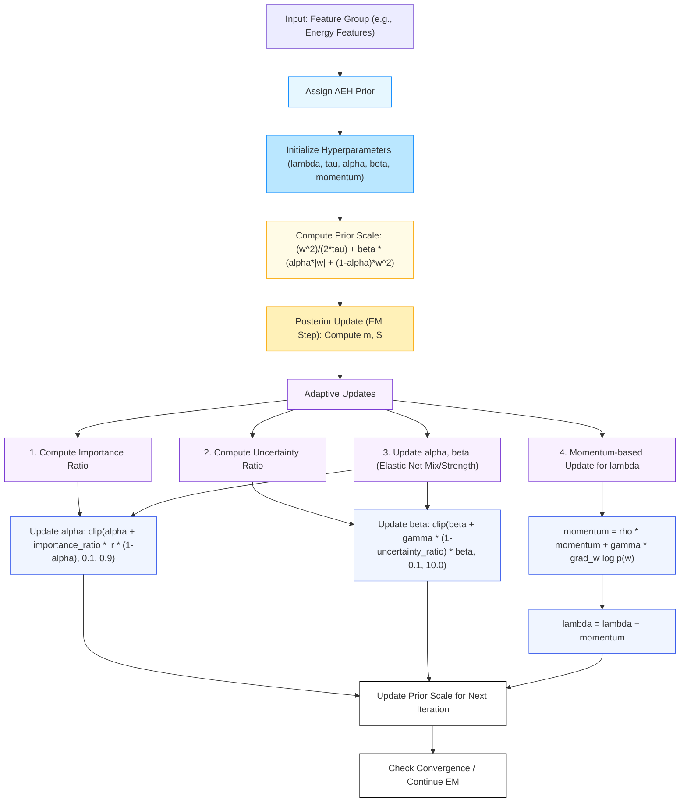

# Internal Mechanism of the Adaptive Elastic Horseshoe (AEH) Prior

Below is a detailed diagram of the internal mechanism of the AEH prior as implemented in the Adaptive Prior ARD model. This diagram illustrates the flow from feature group assignment, through AEH prior initialization, prior scale computation, EM-based posterior update, and the full adaptive update mechanism (importance/uncertainty ratios, elastic net mixing, momentum-based lambda update), looping until convergence.

**Figure:** *Internal mechanism of the Adaptive Elastic Horseshoe (AEH) prior. The process begins with feature group assignment and AEH prior initialization, proceeds through prior scale computation and EM-based posterior update, and includes adaptive updates for hyperparameters (importance/uncertainty ratios, elastic net mixing, and momentum-based lambda update). The loop continues until convergence is achieved.* 