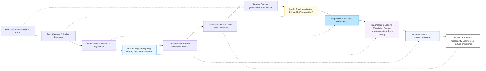

# Data Flow Pipeline: Adaptive Prior ARD Model

Below is a high-level data flow pipeline for the Adaptive Prior ARD model, arranged in a true zigzag (snake) layout for clarity and compactness.

**Figure:** *Data flow pipeline for the Adaptive Prior ARD model, arranged in a true zigzag (snake) layout. The process begins with raw data acquisition and proceeds through cleaning, imputation, feature engineering, selection, scaling, model training, adaptive prior updates, diagnostics, evaluation, and outputs.* 