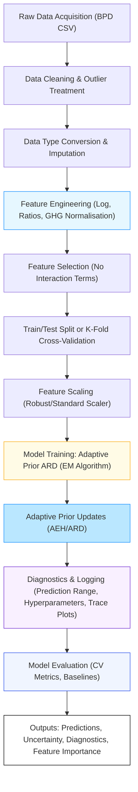

# Data Flow Pipeline: Adaptive Prior ARD Model

Below is a high-level data flow pipeline for the Adaptive Prior ARD model as implemented in this research. The diagram illustrates the end-to-end process from raw data acquisition to final model outputs, including all major preprocessing, feature engineering, and diagnostic steps.

**Figure:** *Data flow pipeline for the Adaptive Prior ARD model. The process begins with raw data acquisition and proceeds through cleaning, imputation, and advanced feature engineering. After feature selection and scaling, the model is trained using the EM algorithm with adaptive prior updates. Comprehensive diagnostics and evaluation are performed, and the pipeline outputs predictions, uncertainty estimates, and detailed diagnostics for research and decision support.* 