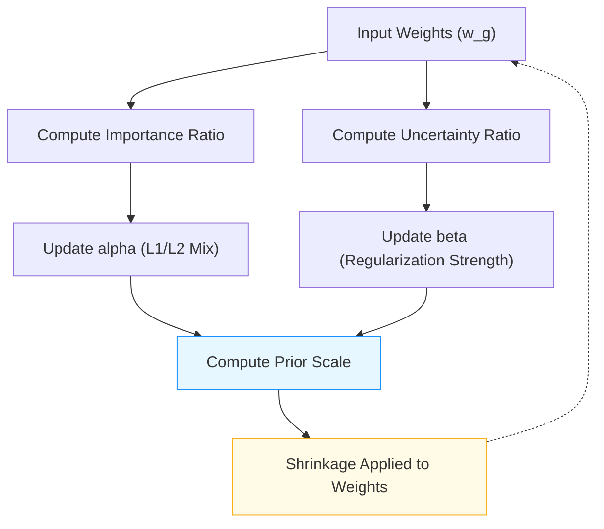

# Conceptual Diagram: AEH Prior Adaptive Shrinkage

Below is a conceptual diagram illustrating the adaptive shrinkage mechanism of the AEH prior.

**Figure:** *Conceptual diagram of the AEH prior's adaptive shrinkage mechanism. Feature importance and uncertainty ratios drive updates to the L1/L2 mix (alpha) and regularization strength (beta), which together determine the prior scale and the amount of shrinkage applied to each weight. The process is adaptive and iterative.* 