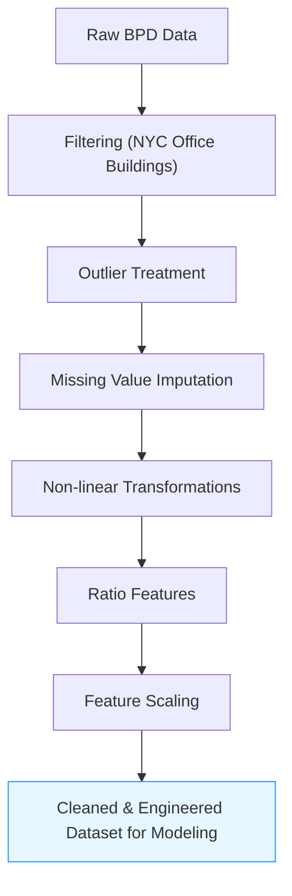

# Data Processing Flowchart

Below is a flowchart illustrating the data processing pipeline from raw data acquisition to the final engineered dataset used for modeling.

**Figure:** *Data processing pipeline from raw BPD data to the final cleaned and engineered dataset for modeling.* 