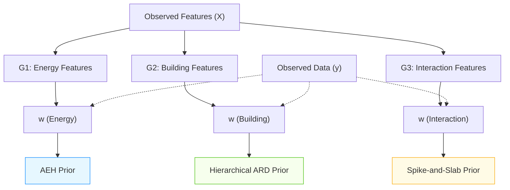

# Hierarchical Model Structure with Prior Assignments

Below is a diagram illustrating the hierarchical model structure and group-wise prior assignments.

**Figure:** *Hierarchical model structure with group-wise prior assignments. Each feature group is assigned a specific prior: AEH for energy features, hierarchical ARD for building features, and spike-and-slab for interaction features.* 