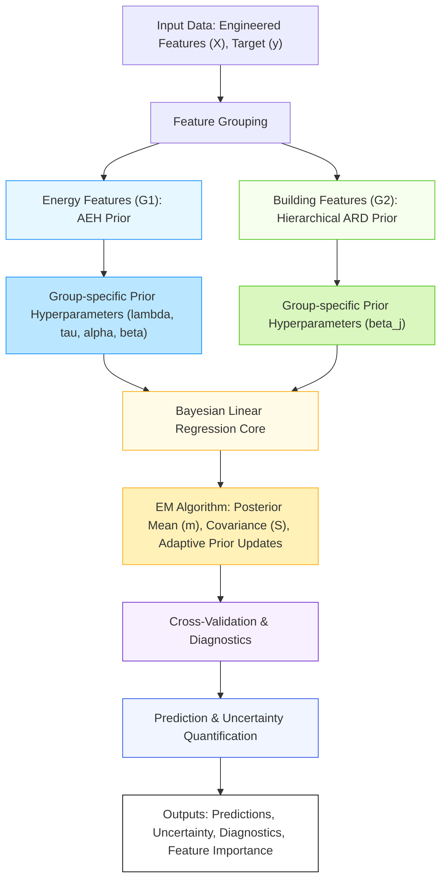

# Model Architecture Diagram: Adaptive Prior ARD with AEH Prior

Below is a high-level architecture diagram of the Adaptive Prior ARD model as implemented in the current research. This diagram illustrates the flow from input data through feature grouping, group-specific priors, Bayesian regression, EM-based inference, diagnostics, and final outputs.

**Figure:** *Model architecture for the Adaptive Prior ARD with AEH prior. The pipeline begins with input data, proceeds through feature grouping and assignment of group-specific priors, then Bayesian linear regression with EM-based inference and adaptive prior updates. Diagnostics and cross-validation are integrated, and the model outputs both predictions and uncertainty estimates, along with detailed diagnostics and feature importance.* 