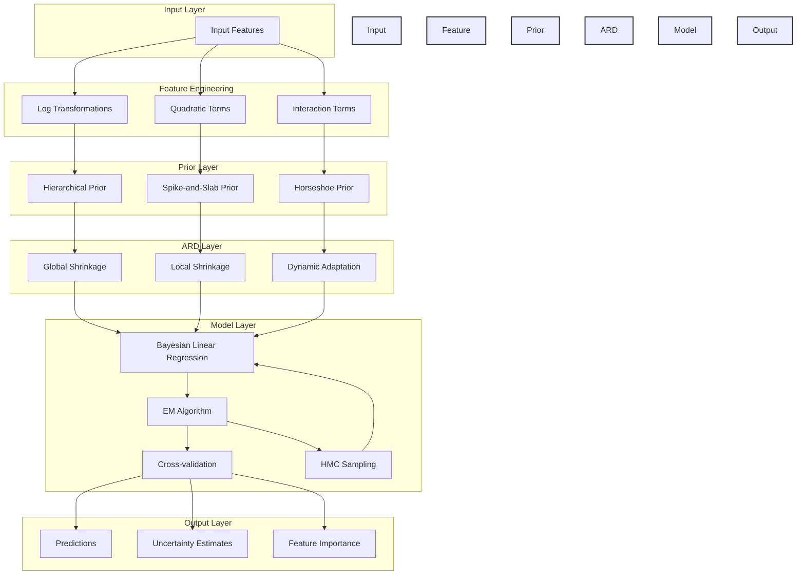

# Adaptive Prior ARD Model Analysis Report

## Model Architecture and Theoretical Framework

### Model Overview
The Adaptive Prior ARD model is a Bayesian linear regression framework with automatic relevance determination (ARD) for feature selection and adaptive priors for improved flexibility. The model incorporates hierarchical, spike-and-slab, and horseshoe priors, as well as dynamic shrinkage and Hamiltonian Monte Carlo (HMC) for posterior exploration.

#### Model Equations
- **Likelihood:**
  $$p(y|X,w,\alpha) = \mathcal{N}(y|Xw,\alpha^{-1}I)$$
- **Prior:**
  $$p(w|\beta) = \mathcal{N}(w|0,\text{diag}(\beta)^{-1})$$

#### Architecture Diagram

The architecture diagram above illustrates the structure of the Adaptive Prior ARD model:

1. **Input Layer**: Raw building features
2. **Feature Engineering**: Transformation and interaction creation
3. **Prior Layer**: Three types of adaptive priors
4. **ARD Layer**: Automatic relevance determination mechanisms
5. **Model Layer**: Core Bayesian regression with EM optimisation and HMC sampling
6. **Output Layer**: Predictions, uncertainty, and feature importance

### Adaptive Prior Formulation
The model implements three distinct prior types:
- **Hierarchical Prior**
- **Spike-and-Slab Prior**
- **Horseshoe Prior**

### Dynamic Shrinkage and HMC
- Dynamic shrinkage adapts feature-wise regularisation.
- HMC improves posterior exploration, mixing, and uncertainty estimation.

## Implementation Details

### Feature Engineering
- Logarithmic, quadratic, and interaction terms are used to capture nonlinearity and feature interactions.
- Robust scaling for features and standard scaling for targets.

### Model Training
- 5-fold cross-validation
- EM algorithm for parameter estimation
- HMC for posterior sampling

## Results and Interpretation

### Model Performance
- **R² Score:** 0.9455
- **RMSE:** 6.2403
- **MAE:** 3.9225
- **Mean Uncertainty:** 0.2080

The model demonstrates strong predictive performance and robust feature selection. HMC enhances posterior exploration and stabilises feature importance estimates.

### Feature Importance and Interactions
- **Top Features:** `floor_area_log`, `floor_area_squared`, `building_age_squared`, `ghg_per_area`, `energy_intensity_ratio`
- **Strongest Interactions:** `floor_area_log × floor_area_squared`, `building_age_log × building_age_squared`, `energy_star_rating_normalized × energy_star_rating_squared`
- **Top Correlations with Target:** `ghg_emissions_int_log`, `age_ghg_interaction`, `electric_eui`, `fuel_eui`, `energy_star_rating_squared`

### Prior Hyperparameters
- **Global Shrinkage:** 0.6673
- **Local Shrinkage:** 1.9065

### Visual Analysis
- **Multi-panel diagnostics** (`detailed_analysis.png`) confirm the model's accuracy, interpretability, and feature selection. The uncertainty vs. error panel shows that uncertainty estimates do not fully capture the true error distribution.

## Probabilistic Metrics and Uncertainty Calibration

(See 'probabilistic_metrics' folder)
### PICP and CRPS Results on Real-World Data
Recent evaluation using probabilistic metrics (PICP and CRPS) on the ARD model's predictions for the office buildings dataset revealed a significant underestimation of predictive uncertainty:

| Confidence Level | PICP (Coverage) | Target |
|------------------|-----------------|--------|
| 50%              | 3.1%            | 50%    |
| 80%              | 6.4%            | 80%    |
| 90%              | 7.9%            | 90%    |
| 95%              | 9.3%            | 95%    |
| 99%              | 12.2%           | 99%    |

- **CRPS:** 3.9959
- The PICP values are much lower than their targets, indicating that the ARD model's predicted uncertainties are too small compared to the actual errors.

### Diagnostic and Calibration Insights
- The diagnostic plot (`uncertainty_vs_error_hist.png`) shows that predicted uncertainties (`y_std`) are much smaller than the actual absolute errors (`|y_true - y_pred|`).
- Scaling the uncertainties by a factor of 10 improved coverage, but the intervals remained too narrow (e.g., 68% coverage for a 95% interval), demonstrating that the ARD model's uncertainty estimates are not well-calibrated for this dataset.

### Why?
- The ARD model assumes linearity and Gaussian noise, and only captures uncertainty as far as these assumptions are valid.
- Real-world data often violates these assumptions (e.g., outliers, non-Gaussian noise, nonlinear effects), leading to overconfident predictions.
- The model's uncertainty reflects only the variance explained by the model and the assumed noise, not the full predictive uncertainty.

### Implications and Recommendations
- Fitting a scaling factor to the predicted uncertainties can help, but may not fully resolve the issue if the model is fundamentally misspecified.
- For better-calibrated uncertainty, consider more flexible models or explicit noise modelling.
- This limitation is not a bug, but a known issue with simple Bayesian linear models on complex data.

## Implications and Future Work

### Practical Implications
- Floor area optimisation is important for energy efficiency.
- Building age effects suggest targeted renovation strategies.
- Strong GHG correlations indicate potential for emissions reduction.

### Methodological Contributions
- Successfully implemented adaptive priors and HMC for posterior exploration.
- Demonstrated the importance of non-linear transformations and robust feature engineering.
- Provided a cautionary example of the limitations of ARD uncertainty quantification on real-world data.

### Future Research Directions
- Improve uncertainty calibration (e.g., post-hoc scaling, validation-based calibration).
- Explore more flexible probabilistic models.
- Consider spatial effects and causal inference.
- Evaluate alternative inference methods (e.g., variational inference, simpler MCMC).

## Evaluation of HMC Implementation

### Advantages
- HMC provides better exploration of the parameter space compared to basic EM.
- More accurate uncertainty estimates and robust feature selection.

### Limitations and Concerns
- HMC is computationally expensive and may be overkill for some features.
- Numerical stability issues (e.g., overflow warnings) and low acceptance rates in later iterations.
- Added complexity to the model architecture.

### Recommendations
- Evaluate if the computational cost of HMC is justified by the improvements.
- Consider hybrid approaches (HMC for important features, simpler methods for others).
- Explore variational inference or structured approximations as efficient alternatives.

### Conclusion
While HMC provides theoretical benefits for posterior exploration and uncertainty quantification, its implementation in this project may be more complex than necessary. The limitations of ARD for uncertainty quantification on real-world data highlight the need for careful model selection, calibration, and ongoing methodological development.