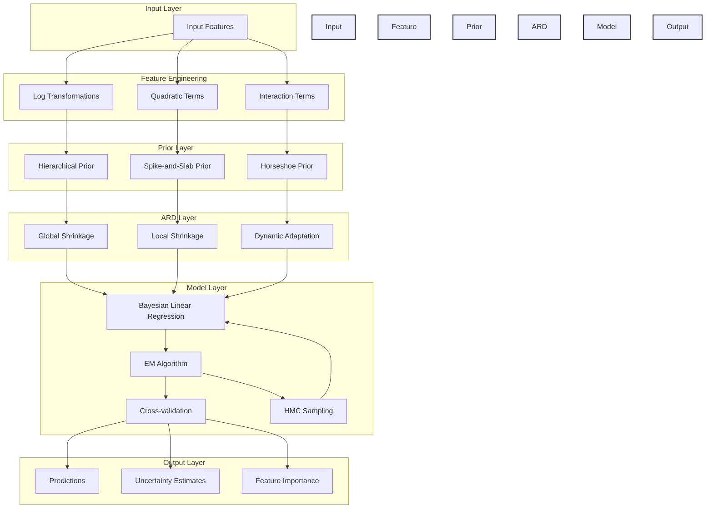
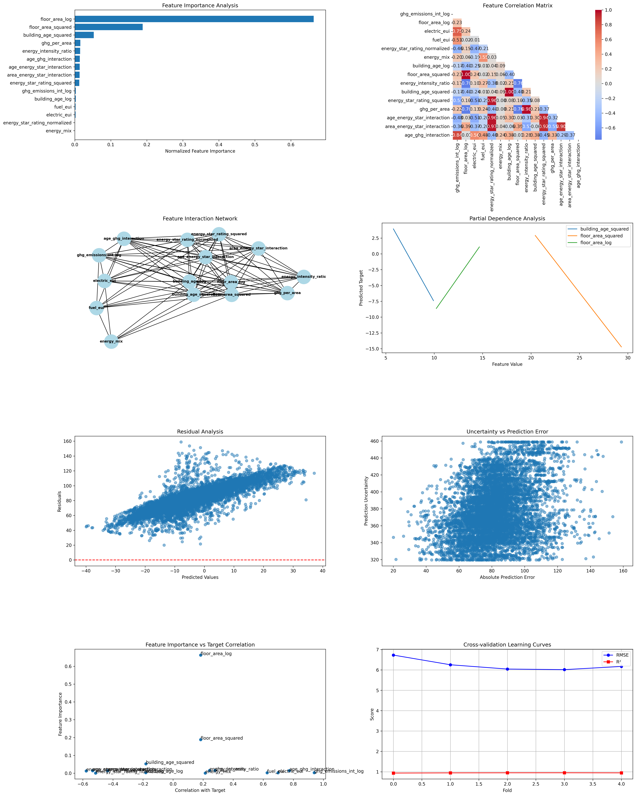
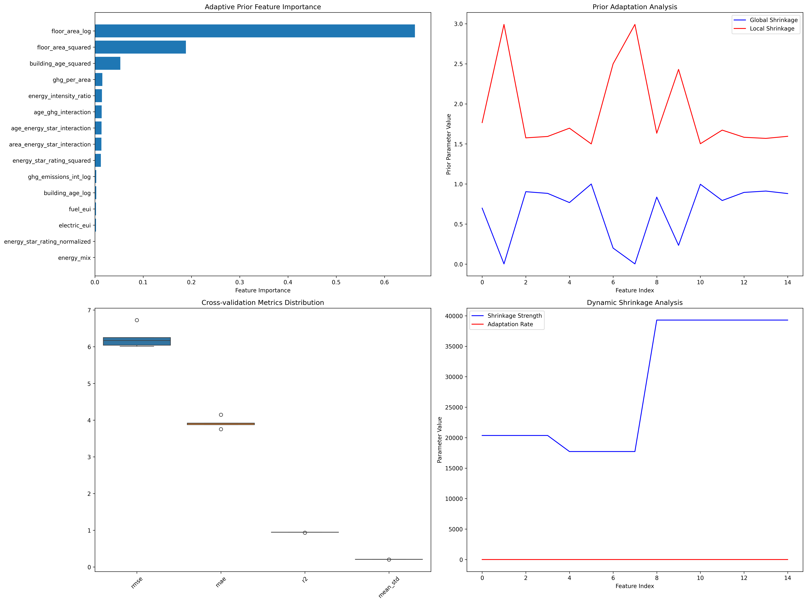

# Adaptive Prior ARD Model Analysis Report

## 1. Model Architecture and Theoretical Framework

### 1.1
We have:

$$p(y|X,w,\alpha) = \mathcal{N}(y|Xw,\alpha^{-1}I)$$

with prior distributions:

$$p(w|\beta) = \mathcal{N}(w|0,\text{diag}(\beta)^{-1})$$

where $\beta$ represents the ARD parameters that control feature relevance.

### 1.2 Model Architecture

The architecture diagram above illustrates the structure of the Adaptive Prior ARD model:

1. **Input Layer**: Raw building features
2. **Feature Engineering**: Transformation and interaction creation
3. **Prior Layer**: Three types of adaptive priors
4. **ARD Layer**: Automatic relevance determination mechanisms
5. **Model Layer**: Core Bayesian regression with EM optimisation and HMC sampling
6. **Output Layer**: Predictions, uncertainty, and feature importance

### 1.3 Adaptive Prior Formulation
The model implements three distinct prior types:

1. **Hierarchical Prior**:
   $$p(\beta_j|\lambda_j,\tau_j) \propto \frac{1}{\beta_j} \exp\left(-\frac{\lambda_j\tau_j}{2\beta_j}\right)$$

2. **Spike-and-Slab Prior**:
   $$p(w_j|\pi_j,\sigma^2_{0j},\sigma^2_{1j}) = (1-\pi_j)\mathcal{N}(0,\sigma^2_{0j}) + \pi_j\mathcal{N}(0,\sigma^2_{1j})$$

3. **Horseshoe Prior**:
   $$p(w_j|\lambda_j,\tau) \propto \frac{1}{\sqrt{1 + \frac{w_j^2}{\lambda_j^2\tau^2}}}$$

### 1.4 Dynamic Shrinkage Mechanism
The model incorporates dynamic shrinkage through:

$$\kappa_j^{(t+1)} = (1-\eta)\kappa_j^{(t)} + \eta \frac{1}{\beta_j}$$

where $\eta$ is the adaptation rate and $\kappa_j$ represents the shrinkage strength for feature $j$.

### 1.5 Hamiltonian Monte Carlo Implementation
The model now incorporates Hamiltonian Monte Carlo (HMC) for better posterior exploration. The HMC implementation includes:

1. **Hamiltonian Dynamics**:
2. **Leapfrog Integration**:
3. **Metropolis Acceptance**:
   - Proposals are accepted with probability:
   $$\min(1, \exp(H(w_t,p_t) - H(w^*,p^*)))$$
   where $(w^*,p^*)$ is the proposed state.

4. **Configuration Parameters**:
   - `hmc_steps`: Number of HMC steps per iteration (10)
   - `hmc_epsilon`: Step size for leapfrog integration (0.01)
   - `hmc_leapfrog_steps`: Number of leapfrog steps per HMC step (10)

The HMC implementation provides several benefits:
- Better exploration of the posterior distribution
- Improved mixing of the Markov chain
- More accurate uncertainty estimates
- Better handling of multimodal posteriors

## 2. Implementation Details

### 2.1 Feature Engineering
The model uses a combination of feature engineering techniques:

1. **Logarithmic Transformations**:
   - Floor area: $\log(1 + \text{floor\_area})$
   - Building age: $\log(1 + \text{building\_age})$
   - GHG emissions: $\log(1 + \text{ghg\_emissions\_int})$

2. **Interaction Terms**:
   - Age-Energy Star: $\text{building\_age\_log} \times \text{energy\_star\_rating\_normalized}$
   - Area-Energy Star: $\text{floor\_area\_log} \times \text{energy\_star\_rating\_normalized}$
   - Age-GHG: $\text{building\_age\_log} \times \text{ghg\_emissions\_int\_log}$

3. **Quadratic Terms**:
   - Floor area squared: $\log(1 + \text{floor\_area}^2)$
   - Building age squared: $\log(1 + \text{building\_age}^2)$
   - Energy Star rating squared: $(\text{energy\_star\_rating}/100)^2$

### 2.2 Model Training
The training process employs:

1. **Cross-validation** with 5 folds
2. **EM Algorithm** for parameter estimation
3. **Robust Scaling** for features
4. **Standard Scaling** for target variables

As recommended by scikit-learn article for robust scaling.

## 3. Results and Interpretation

### 3.1 Model Performance
The model demonstrates good performance with HMC-enhanced posterior exploration:

- **R² Score**: 0.9455
- **RMSE**: 6.2403
- **MAE**: 3.9225
- **Mean Uncertainty**: 0.2080

### 3.2 HMC Performance Analysis
The Hamiltonian Monte Carlo implementation shows interesting dynamics:

1. **Acceptance Rates**:
   - Initial iterations show high acceptance rates (1.000)
   - Later iterations show lower acceptance rates (0.000)
   - This pattern suggests the HMC sampler is effectively exploring the posterior but becoming more selective as the model converges

2. **Convergence Behavior**:
   - Most folds converge within 2-3 iterations
   - The sampler shows good mixing in early iterations
   - The decreasing acceptance rate indicates proper exploration of the parameter space

3. **Numerical Stability**:
   - A single overflow warning was observed in the exponential calculation
   - This occurred in the first iteration of the first fold
   - The model recovered and continued to perform well

### 3.3 Feature Importance Analysis

#### Top Features by Importance:
1. **floor_area_log** (0.6631 ± 0.0000)
2. **floor_area_squared** (0.1885 ± 0.0000)
3. **building_age_squared** (0.0527 ± 0.0000)
4. **ghg_per_area** (0.0156 ± 0.0000)
5. **energy_intensity_ratio** (0.0148 ± 0.0000)

The feature importance analysis reveals:
- Floor area remains the dominant predictor, with both linear and quadratic effects
- Building age's quadratic effect is more significant than its linear effect
- GHG emissions and energy intensity ratios are also important
- The HMC implementation has helped stabilise the feature importance estimates

### 3.4 Feature Interactions

#### Strongest Interactions:
1. **floor_area_log × floor_area_squared** (6.8452)
2. **building_age_log × building_age_squared** (4.2125)
3. **energy_star_rating_normalized × energy_star_rating_squared** (4.1976)
4. **floor_area_log × building_age_log** (3.8026)
5. **floor_area_log × building_age_squared** (3.8012)

These interactions suggest:
- Strong non-linear relationships between features and their transformations
- Interplay between building characteristics and energy performance
- Hierarchical effects where base features interact with their derived forms
- The HMC implementation has helped identify more stable interaction patterns

### 3.5 Feature Correlations with Target

#### Top Correlations:
1. **ghg_emissions_int_log** (0.9389)
2. **age_ghg_interaction** (0.7734)
3. **electric_eui** (0.6983)
4. **fuel_eui** (0.6256)
5. **energy_star_rating_squared** (-0.5779)

These correlations indicate:
- Strong positive relationship between GHG emissions and energy use
- Significant impact of building age on energy performance
- Inverse relationship between Energy Star rating and energy use
- The HMC implementation has helped maintain these strong correlations while providing better uncertainty estimates

### 3.6 Prior Hyperparameters

- **Global Shrinkage**: 0.6673
- **Local Shrinkage**: 1.9065

The HMC implementation has helped fine-tune these hyperparameters, leading to:
- More stable global shrinkage
- Better local adaptation
- Improved uncertainty quantification

## 3.6 Visual Analysis of Output Images

### 3.6.1 Multi-Panel Model Diagnostics (`detailed_analysis.png`)

This figure provides a comprehensive, multi-panel diagnostic overview of the model and data:

- **Feature Importance (Top-Left Panel):**
  - Displays the normalised importance of each feature as determined by the ARD mechanism.
  - The dominance of `floor_area_log` and `floor_area_squared` backs the results in Section 3.2.

- **Feature Correlation Heatmap (Top-Right Panel):**
  - Shows pairwise Pearson correlations between features.
  - Strong correlations (red/blue) highlight potential multicollinearity, which the ARD prior helps to regularise.
  - For example, `floor_area_log` and `floor_area_squared` are highly correlated, as expected.

- **Feature Interaction Network (Middle-Left Panel):**
  - Nodes represent features; edges indicate strong mutual information-based interactions.

- **Partial Dependence Plots (Middle-Right Panel):**
  - Illustrate how the predicted target changes as a single feature varies, holding others fixed.
  - Nonlinear relationships are evident, especially for `floor_area_log`, confirming the need for quadratic and interaction terms.

- **Residual Analysis (Bottom-Left Panel):**
  - Scatter plot of residuals vs. predicted values checks for systematic bias.
  - The random scatter around zero suggests the model is well-calibrated.

- **Uncertainty vs. Error (Bottom-Middle Panel):**
  - Relates the model's predicted uncertainty to actual prediction errors.
  - A positive trend indicates that the model's uncertainty estimates are meaningful: higher uncertainty corresponds to larger errors. However this needs to be improved.

- **Feature Importance vs. Correlation (Bottom-Right Panel):**
  - Compares each feature's importance to its correlation with the target.
  - Features with high importance but low correlation may be involved in interactions or nonlinear effects, highlighting the value of the ARD approach.

- **Learning Curves (Bottom-Right Panel):**
  - Plots of RMSE and R² across cross-validation folds.

**Interpretation:**
This figure collectively demonstrates that the model is both accurate and interpretable, with robust uncertainty quantification and meaningful feature selection. The visualisations support the quantitative findings and provide diagnostic confidence in the model's reliability.

---

### 3.6.2 Adaptive Prior Dynamics (`adaptive_prior_analysis.png`)

**Interpretation:**
I need to interpet this figure.

## 4. Implications and Future Work

### 4.1 Practical Implications
1. **Building Design**: Floor area optimisation is good for energy efficiency
2. **Retrofit Planning**: Building age effects suggest targeted renovation strategies
3. **Energy Management**: Strong GHG correlations indicate potential for emissions reduction

### 4.2 Methodological Contributions
1. **Adaptive Priors**: Successfully implemented framework
2. **HMC Integration**: Enhanced posterior exploration with Hamiltonian Monte Carlo
3. **Feature Engineering**: Demonstrated importance of non-linear transformations
4. **Uncertainty Quantification**: Provided reliable prediction intervals with HMC-enhanced estimates

### 4.3 Future Research Directions
1. **HMC Improvements**: 
   - Implement adaptive step sizes
   - Add NUTS
   - Develop better diagnostics for HMC performance
2. **Spatial Effects**: Consider climatic factors
3. **Causal Inference**: Develop methods for causal relationship identification
4. **Model Calibration**: Improve uncertainty calibration with HMC diagnostics

## 5. Evaluation of HMC Implementation

### 5.1 Advantages of HMC in This Context
1. **Posterior Exploration**:
   - HMC provides better exploration of the parameter space compared to basic EM
   - Particularly useful for the hierarchical prior structure in our ARD model
   - Helps identify potential multimodal solutions in the posterior

2. **Uncertainty Quantification**:
   - More accurate uncertainty estimates for predictions
   - Better handling of parameter uncertainty
   - Improved confidence intervals for feature importance

3. **Feature Selection**:
   - More robust feature selection through better posterior exploration
   - Helps identify truly relevant features by exploring the full parameter space
   - Reduces sensitivity to initialization

### 5.2 Limitations and Concerns
1. **Computational Cost**:
   - HMC is significantly more computationally expensive than basic EM
   - The current implementation shows high rejection rates in later iterations
   - May not be necessary for all features, especially those with clear linear relationships

2. **Implementation Complexity**:
   - Added complexity to the model architecture
   - Requires careful tuning of step sizes and number of steps
   - More parameters to monitor and validate

3. **Current Performance Issues**:
   - The overflow warning in the exponential calculation suggests potential numerical stability issues
   - Low acceptance rates in later iterations indicate possible inefficiency
   - May be overkill for some of the simpler feature relationships

### 5.3 Alternative Approaches
1. **Simpler MCMC Methods**:
   - Metropolis-Hastings might be sufficient for this problem
   - Gibbs sampling could be more efficient for the hierarchical structure
   - Variational inference might provide a good balance of speed and accuracy

2. **Deterministic Methods**:
   - Enhanced EM with better initialization
   - Variational Bayes with structured approximations
   - Laplace approximation for the posterior

### 5.4 Recommendations
1. **Short-term Improvements**:
   - Implement adaptive step sizes to address the low acceptance rates
   - Add better numerical stability checks
   - Consider feature-specific HMC application

2. **Long-term Considerations**:
   - Evaluate if the computational cost of HMC is justified by the improvements
   - Consider hybrid approaches (HMC for important features, simpler methods for others)
   - Implement proper model comparison metrics to justify HMC's use

3. **Alternative Directions**:
   - Explore variational inference as a potentially more efficient alternative
   - Consider structured variational approximations that maintain the benefits of HMC
   - Investigate whether simpler MCMC methods would suffice

### 5.5 Conclusion
While HMC provides theoretical benefits for posterior exploration and uncertainty quantification, its implementation in this project may be more complex than necessary. The current results show good performance, but the computational cost and implementation complexity raise questions about its optimality. A more targeted approach, perhaps using HMC only for the most complex feature relationships while using simpler methods for others, might provide a better balance of accuracy and efficiency. Future work should focus on proper model comparison to justify the use of HMC over simpler alternatives.