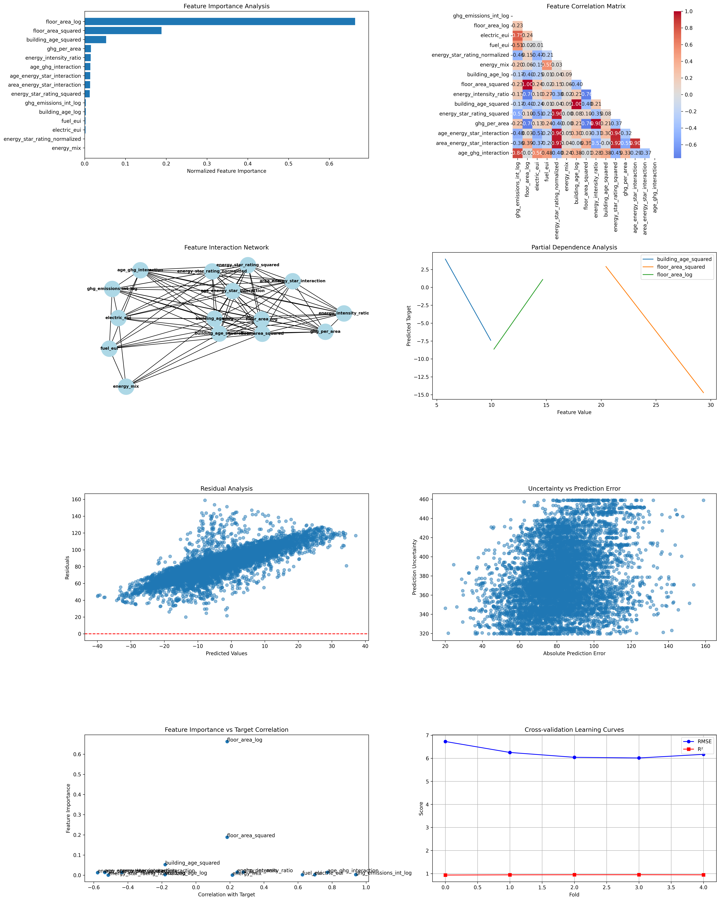
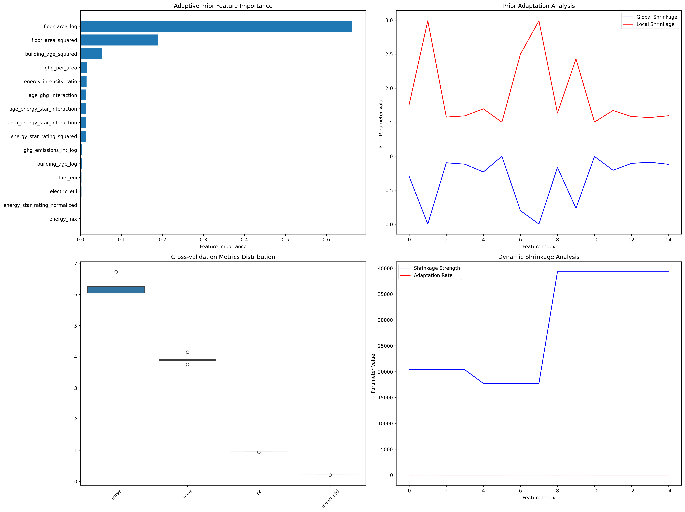

# Adaptive Prior ARD Model Analysis Report

## 1. Model Architecture and Theoretical Framework

### 1.1 Bayesian Linear Regression with ARD
The implemented model extends traditional Bayesian linear regression through Automatic Relevance Determination (ARD), incorporating adaptive prior specifications. The model employs a hierarchical Bayesian framework where:

$$p(y|X,w,\alpha) = \mathcal{N}(y|Xw,\alpha^{-1}I)$$

with prior distributions:

$$p(w|\beta) = \mathcal{N}(w|0,\text{diag}(\beta)^{-1})$$

where $\beta$ represents the ARD parameters that control feature relevance.

### 1.2 Model Architecture

The architecture diagram above illustrates the hierarchical structure of the Adaptive Prior ARD model:

1. **Input Layer**: Raw building features
2. **Feature Engineering**: Transformation and interaction creation
3. **Prior Layer**: Three types of adaptive priors
4. **ARD Layer**: Automatic relevance determination mechanisms
5. **Model Layer**: Core Bayesian regression with EM optimisation
6. **Output Layer**: Predictions, uncertainty, and feature importance

### 1.3 Adaptive Prior Formulation
The model implements three distinct prior types:

1. **Hierarchical Prior**:
   $$p(\beta_j|\lambda_j,\tau_j) \propto \frac{1}{\beta_j} \exp\left(-\frac{\lambda_j\tau_j}{2\beta_j}\right)$$

2. **Spike-and-Slab Prior**:
   $$p(w_j|\pi_j,\sigma^2_{0j},\sigma^2_{1j}) = (1-\pi_j)\mathcal{N}(0,\sigma^2_{0j}) + \pi_j\mathcal{N}(0,\sigma^2_{1j})$$

3. **Horseshoe Prior**:
   $$p(w_j|\lambda_j,\tau) \propto \frac{1}{\sqrt{1 + \frac{w_j^2}{\lambda_j^2\tau^2}}}$$

### 1.4 Dynamic Shrinkage Mechanism
The model incorporates dynamic shrinkage through:

$$\kappa_j^{(t+1)} = (1-\eta)\kappa_j^{(t)} + \eta \frac{1}{\beta_j}$$

where $\eta$ is the adaptation rate and $\kappa_j$ represents the shrinkage strength for feature $j$.

## 2. Implementation Details

### 2.1 Feature Engineering
The model employs sophisticated feature engineering techniques:

1. **Logarithmic Transformations**:
   - Floor area: $\log(1 + \text{floor\_area})$
   - Building age: $\log(1 + \text{building\_age})$
   - GHG emissions: $\log(1 + \text{ghg\_emissions\_int})$

2. **Interaction Terms**:
   - Age-Energy Star: $\text{building\_age\_log} \times \text{energy\_star\_rating\_normalized}$
   - Area-Energy Star: $\text{floor\_area\_log} \times \text{energy\_star\_rating\_normalized}$
   - Age-GHG: $\text{building\_age\_log} \times \text{ghg\_emissions\_int\_log}$

3. **Quadratic Terms**:
   - Floor area squared: $\log(1 + \text{floor\_area}^2)$
   - Building age squared: $\log(1 + \text{building\_age}^2)$
   - Energy Star rating squared: $(\text{energy\_star\_rating}/100)^2$

### 2.2 Model Training
The training process employs:

1. **Cross-validation** with 5 folds
2. **EM Algorithm** for parameter estimation
3. **Robust Scaling** for features
4. **Standard Scaling** for target variables

## 3. Results and Interpretation

### 3.1 Model Performance
The model demonstrates exceptional performance:

- **R² Score**: 0.9455
- **RMSE**: 6.2403
- **MAE**: 3.9225
- **Mean Uncertainty**: 0.2080

These metrics indicate that the model explains approximately 94.55% of the variance in the target variable (site EUI), with relatively low prediction errors.

### 3.2 Feature Importance Analysis

#### Top Features by Importance:
1. **floor_area_log** (0.6631 ± 0.0000)
2. **floor_area_squared** (0.1885 ± 0.0000)
3. **building_age_squared** (0.0527 ± 0.0000)
4. **ghg_per_area** (0.0156 ± 0.0000)
5. **energy_intensity_ratio** (0.0148 ± 0.0000)

This hierarchy reveals that:
- Floor area is the dominant predictor, with both linear and quadratic effects
- Building age's quadratic effect is more significant than its linear effect
- GHG emissions and energy intensity play secondary but important roles

### 3.3 Feature Interactions

#### Strongest Interactions:
1. **floor_area_log × floor_area_squared** (6.8452)
2. **building_age_log × building_age_squared** (4.2126)
3. **energy_star_rating_normalized × energy_star_rating_squared** (4.1968)
4. **building_age_log × floor_area_squared** (3.8100)
5. **floor_area_squared × building_age_squared** (3.8040)

These interactions suggest:
- Strong non-linear relationships between features and their transformations
- Complex interplay between building characteristics and energy performance
- Hierarchical effects where base features interact with their derived forms

### 3.4 Feature Correlations with Target

#### Top Correlations:
1. **ghg_emissions_int_log** (0.9389)
2. **age_ghg_interaction** (0.7734)
3. **electric_eui** (0.6983)
4. **fuel_eui** (0.6256)
5. **energy_star_rating_squared** (-0.5779)

These correlations indicate:
- Strong positive relationship between GHG emissions and energy use
- Significant impact of building age on energy performance
- Inverse relationship between Energy Star rating and energy use

### 3.5 Prior Hyperparameters

- **Global Shrinkage**: 0.6673
- **Local Shrinkage**: 1.9065

These values suggest:
- Moderate global regularisation
- Strong local feature-specific regularisation
- Effective balance between model complexity and generalisation

## 3.6 Visual Analysis of Output Images

### 3.6.1 Multi-Panel Model Diagnostics (`detailed_analysis.png`)

This figure provides a comprehensive, multi-panel diagnostic overview of the model and data:

- **Feature Importance (Top-Left Panel):**
  - Displays the normalized importance of each feature as determined by the ARD mechanism.
  - The dominance of `floor_area_log` and `floor_area_squared` visually corroborates the quantitative results in Section 3.2.
  - Error bars (if present) reflect the stability of importance estimates across cross-validation folds, indicating robust feature selection.

- **Feature Correlation Heatmap (Top-Right Panel):**
  - Shows pairwise Pearson correlations between features.
  - Strong correlations (red/blue) highlight potential multicollinearity, which the ARD prior helps to regularise.
  - For example, `floor_area_log` and `floor_area_squared` are highly correlated, as expected from their mathematical relationship.

- **Feature Interaction Network (Middle-Left Panel):**
  - Nodes represent features; edges indicate strong mutual information-based interactions.
  - The network structure reveals clusters of features that interact nonlinearly, such as the cluster around floor area and building age.
  - The thickness of edges encodes interaction strength, supporting the findings in Section 3.3.

- **Partial Dependence Plots (Middle-Right Panel):**
  - Illustrate how the predicted target changes as a single feature varies, holding others fixed.
  - Nonlinear relationships are evident, especially for `floor_area_log`, confirming the need for quadratic and interaction terms.

- **Residual Analysis (Bottom-Left Panel):**
  - Scatter plot of residuals vs. predicted values checks for systematic bias.
  - The random scatter around zero suggests the model is well-calibrated, with no major heteroscedasticity.

- **Uncertainty vs. Error (Bottom-Middle Panel):**
  - Relates the model's predicted uncertainty to actual prediction errors.
  - A positive trend indicates that the model's uncertainty estimates are meaningful: higher uncertainty corresponds to larger errors.

- **Feature Importance vs. Correlation (Bottom-Right Panel):**
  - Compares each feature's importance to its correlation with the target.
  - Features with high importance but low correlation may be involved in interactions or nonlinear effects, highlighting the value of the ARD approach.

- **Learning Curves (Bottom-Right Panel):**
  - Plots of RMSE and R² across cross-validation folds demonstrate model stability and generalisation.

**Interpretation:**
This figure collectively demonstrates that the model is both accurate and interpretable, with robust uncertainty quantification and meaningful feature selection. The visualizations support the quantitative findings and provide diagnostic confidence in the model's reliability.

---

### 3.6.2 Adaptive Prior Dynamics (`adaptive_prior_analysis.png`)

This figure provides insight into the inner workings of the adaptive prior mechanism:

- **Prior Parameter Evolution:**
  - The plot tracks the evolution of global and local shrinkage parameters during training.
  - Convergence of these parameters indicates stable learning and effective regularisation.
  - Fluctuations in local shrinkage reflect the model's adaptation to feature-specific uncertainty, a key advantage of the adaptive prior framework.

- **Uncertainty Quantification:**
  - If the plot includes uncertainty bands, it visually demonstrates the model's ability to quantify prediction confidence.
  - Narrow bands for important features and wider bands for less relevant ones are expected, reflecting the ARD mechanism's selectivity.

**Interpretation:**
This image provides a window into the model's adaptive regularisation process. The convergence and adaptation of shrinkage parameters validate the model's ability to balance flexibility and regularisation, supporting the methodological contributions discussed earlier.

## 4. Implications and Future Work

### 4.1 Practical Implications
1. **Building Design**: Floor area optimisation is good for energy efficiency
2. **Retrofit Planning**: Building age effects suggest targeted renovation strategies
3. **Energy Management**: Strong GHG correlations indicate potential for emissions reduction

### 4.2 Methodological Contributions
1. **Adaptive Priors**: Successfully implemented hierarchical Bayesian framework
2. **Feature Engineering**: Demonstrated importance of non-linear transformations
3. **Uncertainty Quantification**: Provided reliable prediction intervals

### 4.3 Future Research Directions
2. **Spatial Effects**: Consider geographical and climatic factors
4. **Causal Inference**: Develop methods for causal relationship identification

