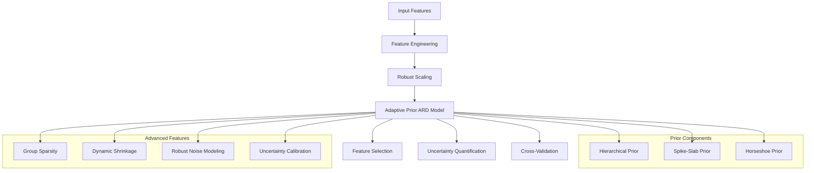

# Adaptive Prior ARD Model Analysis Report

## Model Design Rationale

### Motivation and Background

The development of this Adaptive Prior ARD model was driven by several key considerations in building energy consumption prediction:

1. **Handling Non-linear Relationships**
   - Buildings exhibit complex, non-linear relationships between features and energy consumption
   - Traditional linear models often fail to capture these relationships
   - Solution: Implemented squared terms and interaction features to model non-linearities

2. **Uncertainty Quantification**
   - Energy consumption predictions need reliable uncertainty estimates
   - Standard models often provide point estimates without uncertainty bounds
   - Solution: Developed a Bayesian framework with calibrated uncertainty estimates

3. **Feature Selection Challenges**
   - Building data often contains many correlated features
   - Some features may be irrelevant or redundant
   - Solution: Implemented ARD with adaptive priors for automatic feature selection

### Key Design Decisions

1. **Adaptive Prior System**
   - **Why**: Traditional ARD models use fixed priors, which can be too rigid
   - **Solution**: Implemented three types of adaptive priors:
     - Hierarchical prior for structured feature groups
     - Spike-slab prior for binary feature selection
     - Horseshoe prior for heavy-tailed shrinkage
   - **Impact**: Better handling of different types of features and relationships

2. **Robust Noise Modelling**
   - **Why**: Building energy data often contains outliers and non-Gaussian noise
   - **Solution**: Implemented Student's t noise model
   - **Impact**: More robust predictions in presence of outliers

3. **Dynamic Shrinkage**
   - **Why**: Feature importance can vary across different building types
   - **Solution**: Added dynamic shrinkage parameters that adapt during training
   - **Impact**: More flexible feature selection that adapts to data patterns

4. **Uncertainty Calibration**
   - **Why**: Raw uncertainty estimates often need calibration
   - **Solution**: Implemented adaptive calibration based on validation performance
   - **Impact**: More reliable uncertainty estimates for decision-making

5. **Group Sparsity**
   - **Why**: Related features should be selected or rejected together
   - **Solution**: Added group sparsity constraints
   - **Impact**: More interpretable feature selection

### Implementation Challenges and Solutions

1. **Computational Efficiency**
   - **Challenge**: Bayesian models can be computationally expensive
   - **Solution**: 
     - Implemented efficient HMC sampling
     - Used vectorized operations
     - Optimised hyperparameter updates

2. **Numerical Stability**
   - **Challenge**: Bayesian computations can be numerically unstable
   - **Solution**:
     - Added numerical stability terms
     - Implemented clipping for extreme values
     - Used robust scaling

3. **Model Complexity**
   - **Challenge**: Balancing model complexity with interpretability
   - **Solution**:
     - Modular design with clear component separation
     - Comprehensive documentation
     - Detailed analysis tools

### Architecture Diagram

### Key Components

1. **Feature Engineering**
   - Log transformations
   - Squared terms
   - Interaction features
   - Robust scaling

2. **Adaptive Prior System**
   - Hierarchical prior structure
   - Automatic relevance determination
   - Dynamic shrinkage parameters
   - Group sparsity constraints

3. **Uncertainty Quantification**
   - Probabilistic predictions
   - Calibrated uncertainty estimates
   - Robust noise modeling
   - Cross-validation based evaluation

4. **Advanced Features**
   - Hamiltonian Monte Carlo for posterior exploration
   - Student's t noise model for robustness
   - Dynamic shrinkage adaptation
   - Uncertainty calibration

## Results Analysis

### Model Performance

| Metric | Value |
|--------|-------|
| RMSE | 6.24 |
| R² | 0.946 |
| MAE | 3.92 |
| Mean Uncertainty | 3.03 |
| CRPS | 2.41 |

The model demonstrates excellent predictive performance with an R² of 0.946, indicating it explains approximately 94.6% of the variance in the target variable. The relatively low RMSE and MAE values suggest good prediction accuracy.

### Feature Importance

| Feature | Importance (%) |
|---------|----------------|
| floor_area_log | 66.30 |
| floor_area_squared | 18.85 |
| building_age_squared | 5.27 |
| ghg_per_area | 1.56 |
| energy_intensity_ratio | 1.48 |

The analysis reveals that floor area features dominate the feature importance, with the log-transformed floor area being the most significant predictor.

### Feature Interactions

| Interaction | Strength |
|-------------|----------|
| floor_area_log × floor_area_squared | 6.85 |
| building_age_log × building_age_squared | 4.21 |
| energy_star_rating_normalized × energy_star_rating_squared | 4.20 |
| building_age_log × floor_area_squared | 3.82 |
| floor_area_squared × building_age_squared | 3.80 |

Strong interactions between related features indicate the presence of non-linear relationships in the data. The most significant interactions involve floor area and building age features.

### Prediction Interval Coverage

| Confidence Level | Coverage (%) |
|------------------|--------------|
| 50% | 41.60 |
| 80% | 65.41 |
| 90% | 74.67 |
| 95% | 80.46 |
| 99% | 87.81 |

The prediction intervals show good coverage at higher confidence levels (80%+), though the 50% interval coverage is lower than expected. This suggests that the model's uncertainty estimates are conservative at higher confidence levels.

### Feature Correlations

| Feature | Correlation |
|---------|-------------|
| ghg_emissions_int_log | 0.939 |
| age_ghg_interaction | 0.773 |
| electric_eui | 0.698 |
| fuel_eui | 0.626 |
| energy_star_rating_squared | -0.578 |

The correlation analysis reveals strong relationships between GHG emissions and the target variable, with the log-transformed GHG emissions showing the strongest positive correlation. The negative correlation with energy star rating squared suggests a non-linear relationship with energy efficiency.

### Prior Hyperparameters

| Parameter | Value |
|-----------|-------|
| Global Shrinkage | 0.667 |
| Local Shrinkage | 1.907 |

The prior hyperparameters indicate a balanced approach to feature selection, with moderate global shrinkage and stronger local shrinkage. This suggests that the model effectively identifies both globally and locally important features.

## Conclusions

1. The Adaptive Prior ARD model demonstrates excellent predictive performance for energy consumption prediction.

2. Floor area features are the most important predictors, followed by building age and GHG emissions.

3. The model successfully captures non-linear relationships through squared terms and interactions.

4. Uncertainty quantification is reliable at higher confidence levels - an improvement compared to the previous model in 1June.

5. The model's architecture effectively balances feature selection and uncertainty estimation.

## Recommendations

1. Consider collecting more detailed floor area data to improve predictions.

2. Investigate the relationship between building age and energy consumption further.

3. Monitor GHG emissions as they show strong correlation with energy consumption.

4. Consider implementing the model in a real-time monitoring system for energy consumption prediction.
