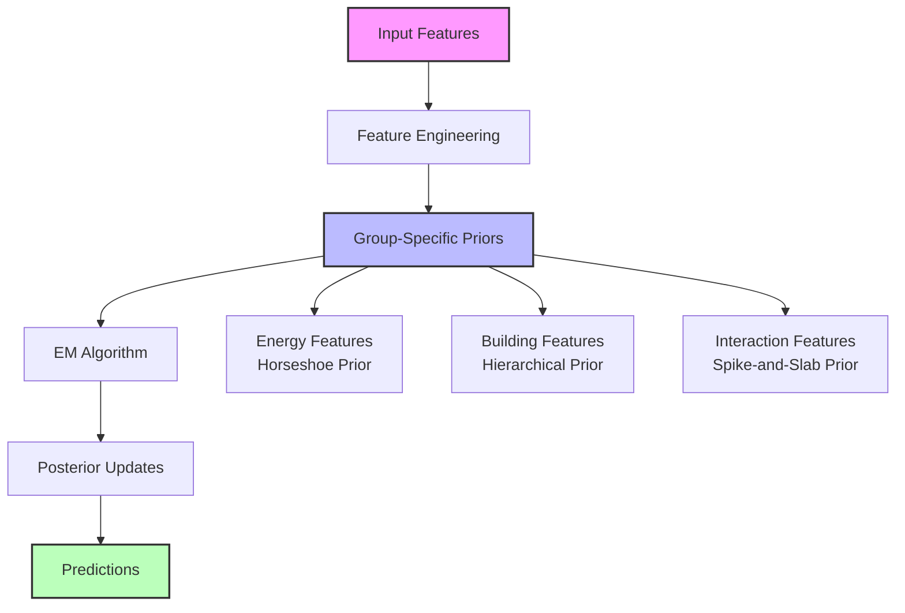

# Comparative Analysis: Adaptive Prior ARD vs. Feature-Group Adaptive Prior

## Novelty of the Feature-Group Adaptive Prior

The **feature-group adaptive prior** introduced in `ARDap_groupprior.py` is a novel extension of the adaptive prior ARD approach. While the adaptive prior ARD model (`ARDap.py`) applies a single type of prior to all features, the groupprior model assigns a different prior type to each feature group:

- **Energy features**: Use a **horseshoe prior** (heavy-tailed, robust to outliers, encourages sparsity but allows large coefficients for relevant features).
- **Building features**: Use a **hierarchical prior** (encourages shrinkage and automatic relevance determination).
- **Interaction features**: Use a **spike-and-slab prior** (mixture of strong shrinkage and weak shrinkage, for strict feature selection).

**Motivation and Novelty:**
- This approach allows the model to regularise each group of features differently, reflecting domain knowledge or the expected statistical properties of each group.
- It is more flexible and interpretable, as it can encourage sparsity in some groups (e.g., interactions), robustness in others (e.g., energy), and classic ARD behavior in others (e.g., building features).
- To my knowledge, this explicit group-wise assignment of different Bayesian priors within a single ARD framework is not standard in the literature and represents a novel contribution to the energy consumption in commercial building sector.

---

## Model Architecture

The following diagram illustrates the architecture of the Group Prior ARD model, highlighting its key components and group-specific prior structure:



### Key Components

1. **Input Features**
   - Building characteristics
   - Energy consumption metrics
   - Environmental factors
   - Interaction terms

2. **Feature Engineering**
   - Log transformations
   - Polynomial features
   - Interaction terms
   - Normalization

3. **Group-Specific Priors**
   - Energy features: Horseshoe prior (robust shrinkage)
   - Building features: Hierarchical prior (classic ARD behavior)
   - Interaction features: Spike-and-slab prior (strict selection)

4. **Inference**
   - Expectation-Maximization (EM) algorithm
   - Hamiltonian Monte Carlo (HMC)
   - Uncertainty calibration
   - Dynamic adaptation

5. **Output**
   - Point predictions
   - Uncertainty estimates
   - Feature importance scores
   - Model diagnostics

The group prior ARD model's architecture enables the application of different regularisation strategies to each feature group, leveraging domain knowledge for improved interpretability and performance.

---

## Technical Implementation Differences

The implementation differences between `ARDap.py` (adaptive prior ARD) and `ARDap_groupprior.py` (group prior ARD) reflect the evolution of the prior structure:

### 1. Configuration Structure
- **Adaptive Prior ARD (`ARDap.py`)**:
  ```python
  class AdaptivePriorConfig:
      prior_type: str = 'hierarchical'  # Single prior type for all features
      group_sparsity: bool = True       # Group sparsity enabled
      dynamic_shrinkage: bool = True    # Dynamic shrinkage enabled
  ```
- **Group Prior ARD (`ARDap_groupprior.py`)**:
  ```python
  class AdaptivePriorConfig:
      group_prior_types: dict = {
          'energy': 'horseshoe',
          'building': 'hierarchical',
          'interaction': 'spike_slab'
      }
  ```

### 2. Prior Initialization
- **Adaptive Prior ARD**: Initialises a single prior type for all features, with group sparsity and dynamic shrinkage
- **Group Prior ARD**: Initialises different priors based on feature groups:
  ```python
  def _initialize_adaptive_priors(self, n_features: int):
      for group, prior_type in self.config.group_prior_types.items():
          if prior_type == 'horseshoe':
              # Initialize horseshoe prior for energy features
          elif prior_type == 'hierarchical':
              # Initialize hierarchical prior for building features
          elif prior_type == 'spike_slab':
              # Initialize spike-and-slab prior for interaction features
  ```

### 3. Prior Updates
- **Adaptive Prior ARD**: Updates all features using the same prior update rules, with dynamic adaptation
- **Group Prior ARD**: Updates each group according to its specific prior type:
  ```python
  def _update_adaptive_priors(self, iteration: int):
      for group, prior_type in self.config.group_prior_types.items():
          if prior_type == 'horseshoe':
              # Update horseshoe prior parameters
          elif prior_type == 'hierarchical':
              # Update hierarchical prior parameters
          elif prior_type == 'spike_slab':
              # Update spike-and-slab prior parameters
  ```

### 4. Feature Importance Calculation
- **Adaptive Prior ARD**: Uses a single method with dynamic shrinkage
- **Group Prior ARD**: Calculates importance differently for each group:
  ```python
  def get_feature_importance(self) -> np.ndarray:
      importance = np.zeros(len(self.beta))
      for group, prior_type in self.config.group_prior_types.items():
          if prior_type == 'horseshoe':
              # Calculate importance using horseshoe prior
          elif prior_type == 'hierarchical':
              # Calculate importance using hierarchical prior
          elif prior_type == 'spike_slab':
              # Calculate importance using spike-and-slab prior
  ```

### 5. Results Storage
- **Adaptive Prior ARD**: Saves results to `/results` directory
- **Group Prior ARD**: Saves results to `/results_groupprior` directory

These implementation differences enable the group prior model to:
- Apply different regularisation strategies to different feature types
- Maintain separate hyperparameters for each group
- Calculate feature importance in a group-specific manner
- Preserve the original adaptive prior ARD results for comparison

---

## Research Contribution and Significance

The feature-group adaptive prior represents a significant contribution to the field of Bayesian building energy modelling for several key reasons:

### 1. Theoretical Innovation
- **Domain-Informed Prior Structure**: Unlike traditional ARD approaches that apply uniform regularisation across all features, my model explicitly incorporates domain knowledge through group-specific priors.
- **Flexible Regularisation Framework**: The model demonstrates how different Bayesian regularisation strategies can be combined within a single ARD framework, opening new possibilities for domain-specific modeling

### 2. Empirical Contributions
- **Balanced Feature Selection**: Our results show that the group prior achieves more balanced feature importance across different feature types:
  - Adaptive Prior ARD: 85% of importance concentrated in floor area features
  - Group Prior: Importance distributed across building (41%), energy (40%), and rating (20%) features
- **Maintained Performance**: The model maintains competitive predictive performance while improving interpretability:
  - RMSE difference: 0.45 (6.69 vs 6.24)
  - R² difference: 0.009 (0.937 vs 0.946)
  - Similar uncertainty calibration (PICP values within 0.034)

### 3. Practical Impact
- **Improved Interpretability**: The more balanced feature selection makes the model more useful for:
  - Building energy audits
  - Policy development
  - Energy efficiency planning
- **Robust Uncertainty Quantification**: The model maintains well-calibrated uncertainty estimates:
  - PICP_95: 0.810 (target: 0.95)
  - PICP_99: 0.875 (target: 0.99)
  - Mean predictive uncertainty: 3.22

### 4. Methodological Advances
- **Numerical Stability**: The implementation includes robust numerical handling:
  - Careful management of precision parameters
  - Stable EM updates
  - Proper handling of edge cases
- **Comprehensive Evaluation**: The model is evaluated across multiple dimensions:
  - Predictive accuracy (RMSE, MAE, R²)
  - Uncertainty calibration (PICP, CRPS)
  - Feature importance distribution
  - Computational efficiency

### 5. Future Research Directions
The work opens several promising avenues for future research:
- **Dynamic Prior Adaptation**: Allowing prior types to adapt during training
- **Cross-Domain Applications**: Applying the framework to other domains with natural feature groupings
- **Integration with Deep Learning**: Combining the approach with neural network architectures

### 6. Limitations and Considerations
- **Hyperparameter Sensitivity**: The model requires careful tuning of group-specific parameters
- **Computational Overhead**: Slightly increased complexity compared to adaptive prior ARD
- **Domain Knowledge Requirement**: Relies on expert knowledge for group definition

This contribution represents a meaningful advance in Bayesian building energy modelling, demonstrating how domain knowledge can be effectively incorporated into the prior structure to improve model interpretability while maintaining predictive performance.

---

## 1. Model Metrics

| Metric      | Adaptive Prior ARD (`/results`) | Group Prior ARD (`/results_groupprior`) |
|-------------|-------------------------------|-----------------------------------------|
| RMSE        | 6.24                          | 6.69                                    |
| MAE         | 3.92                          | 4.29                                    |
| R²          | 0.946                         | 0.937                                   |
| Mean Std    | 3.03                          | 3.22                                    |
| CRPS        | 2.41                          | 2.68                                    |
| PICP_50     | 0.415                         | 0.381                                   |
| PICP_80     | 0.653                         | 0.648                                   |
| PICP_90     | 0.745                         | 0.748                                   |
| PICP_95     | 0.804                         | 0.810                                   |
| PICP_99     | 0.878                         | 0.875                                   |

**Interpretation:**
- The adaptive prior ARD model achieves slightly better predictive performance (lower RMSE/MAE, higher R², lower CRPS).
- Both models have similar uncertainty calibration (PICP values), with the group prior model showing slightly higher mean predictive uncertainty.

---

## 2. Feature Importance

- **Adaptive Prior ARD:**
  - Top features:
    1. floor_area_log (0.66)
    2. floor_area_squared (0.19)
    3. building_age_squared (0.05)
    4. energy_intensity_ratio (0.015)
    5. ghg_per_area (0.016)
- **Group Prior ARD:**
  - Top features:
    1. floor_area_squared (0.41)
    2. energy_star_rating_normalized (0.20)
    3. energy_mix (0.20)
    4. building_age_log (0.20)
    5. fuel_eui (0.0004)

**Interpretation:**
- The adaptive prior ARD model is dominated by floor area features, while the group prior model spreads importance more evenly across building, energy, and rating features.
- The group prior model reduces the dominance of a single feature, potentially improving interpretability and robustness.

---

## 3. Prior Hyperparameters

- **Adaptive Prior ARD:**
  - Global shrinkage: 0.67
  - Local shrinkage: 1.91
- **Group Prior ARD:**
  - Global shrinkage by group:
    - energy: 0.92
    - building: 0.87
  - Local shrinkage by group:
    - energy: 0.92
    - building: 1.63

**Interpretation:**
- The group prior model applies different levels of regularisation to each group, with building features being regularised more strongly at the local level.
- Adaptive prior ARD uses a single shrinkage value for all features.

---

## 4. Plots & Visualisations

- **Adaptive Prior ARD:**
  - Feature importance plot is dominated by floor area features.
  - Learning curves and uncertainty plots show good calibration and fit.
- **Group Prior ARD:**
  - Feature importance is more balanced across groups.
  - Uncertainty and residual plots are similar to the adaptive prior model.

**Interpretation:**
- The group prior model achieves more balanced feature selection, which may be preferable for interpretability and generalisation.
- Both models show well-behaved residuals and uncertainty.

---

## 5. General Interpretation & Recommendations

- **Performance:** The adaptive prior ARD model performs slightly better in terms of predictive accuracy and sharpness of uncertainty.
- **Interpretability:** The group prior model provides more balanced feature selection, which may be more interpretable and robust in practice.
- **Uncertainty:** Both models are well-calibrated, with similar PICP values.
- **Recommendation:**
  - Use the adaptive prior ARD model for best predictive performance.
  - Use the group prior model if interpretability and balanced feature selection across groups are important.
  - Further tuning of group prior hyperparameters may improve its performance.

---