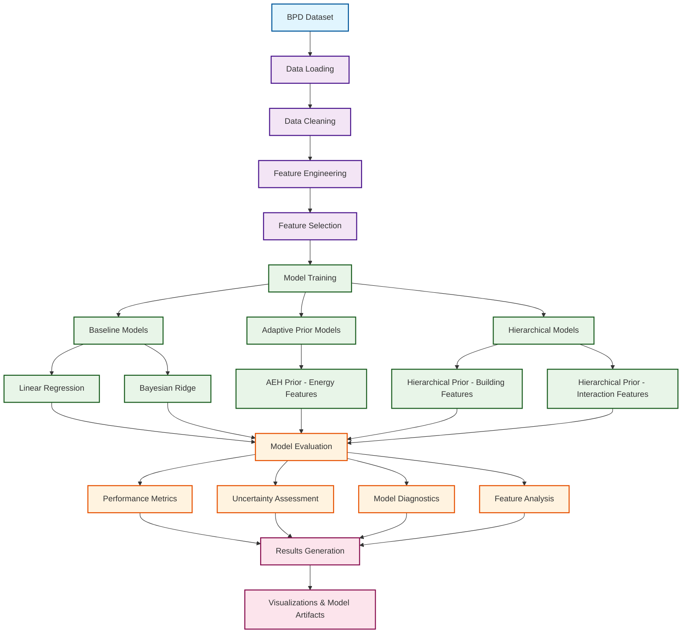

# Data Pipeline: Adaptive Bayesian Regression for Building Energy Performance

## Overview
This document provides a visual representation of the complete data pipeline for the Adaptive Bayesian Regression project, from raw data acquisition through model evaluation and deployment.

## Data Pipeline Diagram

## Pipeline Stages

### 1. Data Sources
- **BPD Dataset**: Building Performance Dataset containing cleaned and preprocessed building energy data

### 2. Data Preprocessing
- **Data Loading**: Load CSV files with proper missing value handling
- **Data Cleaning**: Remove invalid entries and standardize formats
- **Missing Value Treatment**: Median imputation for Energy Star Rating and GHG emissions
- **Outlier Handling**: Clip variables to 1st-99th percentile ranges

### 3. Feature Engineering
- **Log Transformations**: Apply to right-skewed variables (floor_area, building_age, ghg_emissions_int)
- **Ratio Features**: Create energy mix ratios and efficiency metrics
- **Squared Terms**: Add quadratic terms for non-linear relationships
- **Normalization**: Energy Star rating normalized to [0,1] range

### 4. Feature Grouping
The 12 engineered features are organized into 3 groups for specialized prior assignment:

#### Energy Features (4 features) - AEH Prior
- `ghg_emissions_int_log` - GHG emissions intensity (log-transformed)
- `floor_area_log` - Floor area (log-transformed)
- `electric_eui` - Electric energy use intensity
- `fuel_eui` - Fuel energy use intensity

#### Building Features (4 features) - Hierarchical Prior
- `energy_star_rating_normalized` - Normalized Energy Star rating
- `energy_mix` - Energy source complexity metric
- `building_age_log` - Building age (log-transformed)
- `floor_area_squared` - Quadratic floor area effects

#### Interaction Features (4 features) - Hierarchical Prior
- `energy_intensity_ratio` - Energy efficiency metric
- `building_age_squared` - Quadratic age effects
- `energy_star_rating_squared` - Quadratic rating effects
- `ghg_per_area` - Area-normalized emissions

### 5. Model Training
- **Baseline Models**: Linear Regression, Bayesian Ridge for comparison
- **AEH Prior Model**: Adaptive Elastic Horseshoe prior for energy features
- **Hierarchical Models**: Standard hierarchical priors for building and interaction features

### 6. Model Evaluation
- **Performance Metrics**: RMSE, MAE, R² for predictive accuracy
- **Uncertainty Assessment**: Calibration error, interval coverage, prediction intervals
- **Model Diagnostics**: EM convergence, hyperparameter adaptation, posterior analysis
- **Feature Analysis**: Feature importance, SHAP values, partial dependence plots

### 7. Results Generation
- **Visualizations**: Comprehensive plots for model performance and diagnostics
- **Model Artifacts**: Saved models, hyperparameters, and diagnostic logs

## Key Features

### Target Variable
- **`site_eui`**: Site Energy Use Intensity (kWh/m²/year)

### Core Features (12 features total)
1. `ghg_emissions_int_log` - Environmental impact proxy
2. `floor_area_log` - Building size (primary driver)
3. `electric_eui` - Electricity consumption
4. `fuel_eui` - Fuel consumption
5. `energy_star_rating_normalized` - Energy efficiency rating
6. `energy_mix` - Energy source complexity
7. `building_age_log` - Building age
8. `floor_area_squared` - Non-linear size effects
9. `energy_intensity_ratio` - Efficiency metric
10. `building_age_squared` - Non-linear age effects
11. `energy_star_rating_squared` - Non-linear rating effects
12. `ghg_per_area` - Area-normalized emissions

### Feature Groups for Specialized Priors
- **Energy Features (4)**: AEH prior for adaptive regularization
- **Building Features (4)**: Hierarchical prior for stable regularization
- **Interaction Features (4)**: Hierarchical prior for standard regularization

## Data Quality Metrics

### Completeness
- Overall completeness: >95% for core variables
- Critical variables: 100% complete (floor_area, electric_eui, fuel_eui)

### Validity
- Energy use: Positive values only
- Floor area: Minimum 100 m² for office buildings
- Building age: Reasonable range (5-125 years)
- Energy Star: Valid range (0-100)

### Consistency
- Units: Standardized to SI units (kWh, m², kg CO₂e)
- Ranges: Physically plausible values only
- Relationships: Logical consistency between related variables

---

*This data pipeline diagram provides a comprehensive overview of the data processing workflow for the Adaptive Bayesian Regression project. It should be referenced when understanding the complete data flow from raw sources to final model outputs.* 