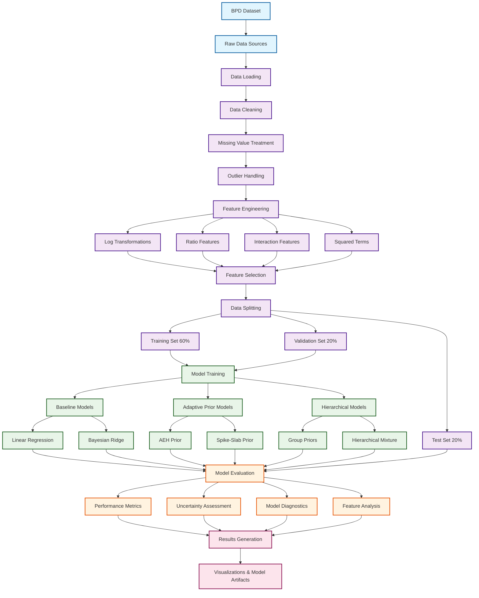

# Data Pipeline: Adaptive Bayesian Regression for Building Energy Performance

## Overview
This document provides a visual representation of the complete data pipeline for the Adaptive Bayesian Regression project, from raw data acquisition through model evaluation and deployment.

## Data Pipeline Diagram

## Pipeline Stages

### 1. Data Sources
- **BPD Dataset**: Building Performance Dataset containing cleaned and preprocessed building energy data

### 2. Data Preprocessing
- **Data Loading**: Load CSV files with proper missing value handling
- **Data Cleaning**: Remove invalid entries and standardize formats
- **Missing Value Treatment**: Median imputation for Energy Star Rating and GHG emissions
- **Outlier Handling**: Clip variables to 1st-99th percentile ranges

### 3. Feature Engineering
- **Log Transformations**: Apply to right-skewed variables (floor_area, building_age, ghg_emissions_int)
- **Ratio Features**: Create energy mix ratios and efficiency metrics
- **Interaction Features**: Generate age-energy_star and area-energy_star interactions
- **Squared Terms**: Add quadratic terms for non-linear relationships

### 4. Data Splitting
- **Training Set (60%)**: Model development and parameter estimation
- **Validation Set (20%)**: Hyperparameter tuning and model selection
- **Test Set (20%)**: Final evaluation and performance assessment

### 5. Model Training
- **Baseline Models**: Linear Regression, Bayesian Ridge
- **Adaptive Prior Models**: AEH Prior, Spike-Slab Prior
- **Hierarchical Models**: Group-specific priors for different feature categories

### 6. Model Evaluation
- **Performance Metrics**: RMSE, MAE, R² for predictive accuracy
- **Uncertainty Assessment**: Calibration error, interval coverage, prediction intervals
- **Model Diagnostics**: Trace plots, convergence diagnostics, posterior analysis
- **Feature Analysis**: Feature importance, SHAP values, partial dependence plots

### 7. Results Generation
- **Visualizations**: Comprehensive plots for model performance and diagnostics
- **Model Artifacts**: Saved models, hyperparameters, and diagnostic logs

## Key Features

### Target Variable
- **`site_eui`**: Site Energy Use Intensity (kWh/m²/year)

### Core Features (12 features)
1. `ghg_emissions_int_log` - Environmental impact proxy
2. `floor_area_log` - Building size (primary driver)
3. `electric_eui` - Electricity consumption
4. `fuel_eui` - Fuel consumption
5. `energy_star_rating_normalized` - Energy efficiency rating
6. `energy_mix` - Energy source complexity
7. `building_age_log` - Building age
8. `floor_area_squared` - Non-linear size effects
9. `energy_intensity_ratio` - Efficiency metric
10. `building_age_squared` - Non-linear age effects
11. `energy_star_rating_squared` - Non-linear rating effects
12. `ghg_per_area` - Area-normalized emissions

### Feature Groups for Hierarchical Priors
- **Energy Features**: electric_eui, fuel_eui, energy_mix, energy_intensity_ratio
- **Building Features**: floor_area_log, building_age_log, energy_star_rating_normalized
- **Environmental Features**: ghg_emissions_int_log, ghg_per_area
- **Interaction Features**: All squared terms and interactions

## Data Quality Metrics

### Completeness
- Overall completeness: >95% for core variables
- Critical variables: 100% complete (floor_area, electric_eui, fuel_eui)

### Validity
- Energy use: Positive values only
- Floor area: Minimum 100 m² for office buildings
- Building age: Reasonable range (5-125 years)
- Energy Star: Valid range (0-100)

### Consistency
- Units: Standardized to SI units (kWh, m², kg CO₂e)
- Ranges: Physically plausible values only
- Relationships: Logical consistency between related variables

---

*This data pipeline diagram provides a comprehensive overview of the data processing workflow for the Adaptive Bayesian Regression project. It should be referenced when understanding the complete data flow from raw sources to final model outputs.* 