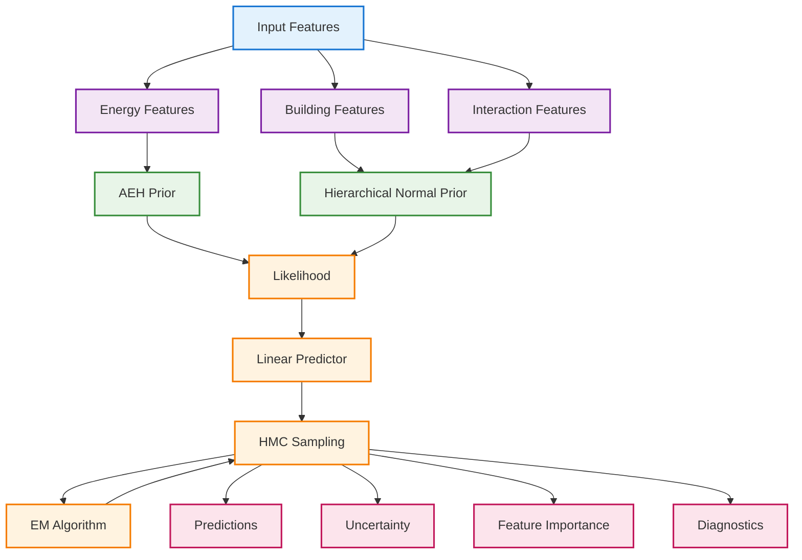

# Group-wise Bayesian Model Architecture with Tailored Prior Assignments

## Overview
This diagram illustrates the hierarchical structure of the Bayesian linear regression framework, showing how features are partitioned into groups and assigned specialised priors (Adaptive Elastic Horseshoe for energy features, Hierarchical Normal for building and interaction features).

## Model Architecture Diagram



## Prior Specifications

### 1. Adaptive Elastic Horseshoe (AEH) Prior
**Applied to: Energy Features**
- **Features**: ghg_emissions_int_log, floor_area_log, electric_eui, fuel_eui
- **Mathematical Form**:
  ```
  β_j ~ Normal(0, τ²λ_j²)
  λ_j ~ Half-Cauchy(0, 1)
  τ ~ Half-Cauchy(0, τ_0)
  τ_0 ~ Gamma(a, b)
  ```
- **Rationale**: Heavy-tailed distribution suitable for energy consumption patterns with extreme values

### 2. Hierarchical Normal Prior
**Applied to: Building & Interaction Features**
- **Building Features**: energy_star_rating_normalized, energy_mix, building_age_log, floor_area_squared
- **Interaction Features**: energy_intensity_ratio, building_age_squared, energy_star_rating_squared, ghg_per_area
- **Mathematical Form**:
  ```
  β_j ~ Normal(μ_g, σ_g²)
  μ_g ~ Normal(0, 10²)
  σ_g² ~ InverseGamma(1, 1)
  ```
- **Rationale**: Captures group structure and provides stable regularisation for building and interaction features

## Model Components

### Likelihood Function
```
y_i ~ Normal(μ_i, σ²)
```
Where y_i is the site energy use intensity for building i.

### Linear Predictor
```
μ_i = X_i^T β
```
Where X_i is the feature vector and β is the coefficient vector.

### Posterior Sampling
- **Method**: Hamiltonian Monte Carlo (HMC)
- **Purpose**: Efficient exploration of posterior distribution
- **Benefits**: Handles complex posterior geometries

### EM Algorithm
- **E-Step**: Posterior sampling via HMC
- **M-Step**: Parameter updates based on posterior samples
- **Convergence**: Monitored through trace diagnostics

## Feature Group Details

### Energy Features (G₁)
- **ghg_emissions_int_log**: Log-transformed GHG emissions intensity
- **floor_area_log**: Log-transformed floor area
- **electric_eui**: Electricity Energy Use Intensity
- **fuel_eui**: Fuel Energy Use Intensity
- **Prior**: Adaptive Elastic Horseshoe
- **Rationale**: Energy consumption patterns often show heavy tails and extreme values

### Building Features (G₂)
- **energy_star_rating_normalized**: Normalised Energy Star rating
- **energy_mix**: Energy source complexity metric
- **building_age_log**: Log-transformed building age
- **floor_area_squared**: Quadratic floor area effects
- **Prior**: Hierarchical Normal
- **Rationale**: Building characteristics have natural hierarchical structure

### Interaction Features (G₃)
- **energy_intensity_ratio**: Efficiency metric
- **building_age_squared**: Quadratic age effects
- **energy_star_rating_squared**: Quadratic rating effects
- **ghg_per_area**: Area-normalised emissions
- **Prior**: Hierarchical Normal
- **Rationale**: Interaction terms benefit from group-level regularisation

## Model Outputs

### Predictions
- **Point Predictions**: ŷ_i = E[y_i | X_i, data]
- **Uncertainty Quantification**: Prediction intervals

### Feature Analysis
- **Feature Importance**: |β_j| for each feature
- **Uncertainty**: Posterior standard deviations
- **Selection**: Effective feature inclusion probabilities