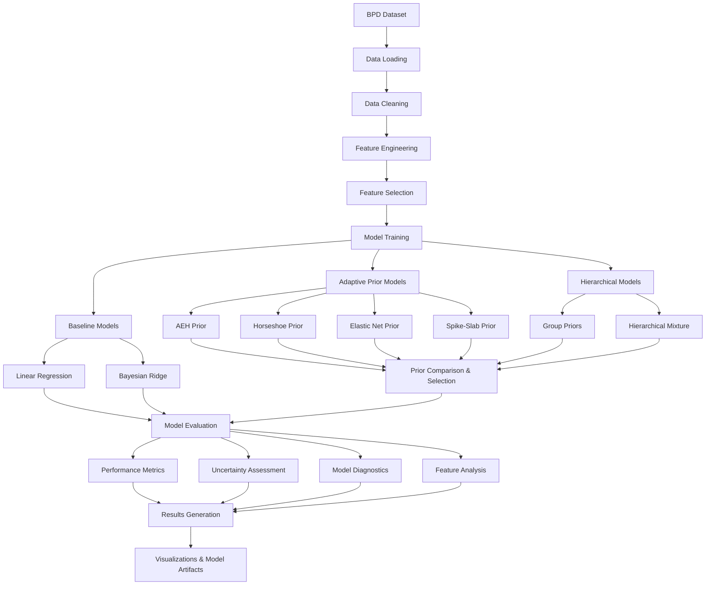
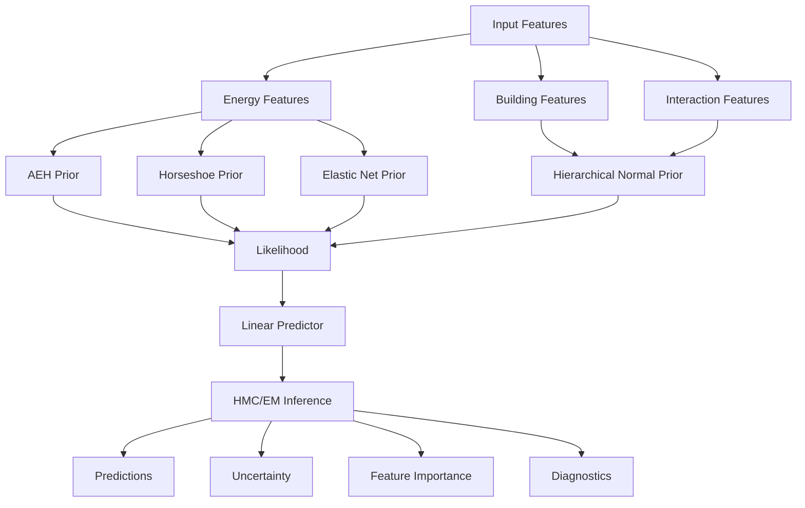

# Updated Model Flowcharts for AEH Prior Comparative Study

## Data Acquisition and Preparation Pipeline

*Fig. 1: Updated pipeline for EUI modelling, including explicit prior comparison and selection for the new model.*

---

## Group-wise Bayesian Model Architecture with Prior Choice

*Fig. 2: Updated group-wise Bayesian model architecture, showing explicit prior choices for energy features in the new model.* 